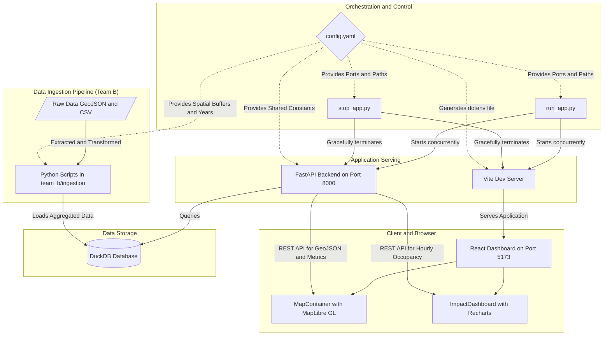
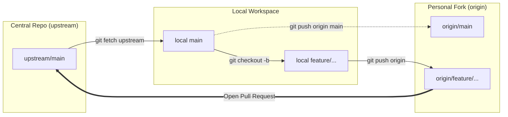

# Victoria Urban Planning - Urban Streetscape Intervention Analysis

This repository is for the SIT Capstone "Chameleon Project" in partnership with Infrastructure Victoria.

## Table of Contents
1. Project Overview
2. Business Problem & Research Question
3. Stream Structure
4. Tech Stack
5. Architecture & Key Components
6. Data Sources & CRS Warning
7. Directory Structure
8. Installation, Setup & Execution
9. Git Workflow & Collaboration Guide
10. Coding Standards

## Project Overview
Infrastructure Victoria is an independent advisory body providing evidence-based research to the Victorian Government. This project evaluates the real-world impacts of streetscape interventions (like new bike lanes, road reallocations, and pedestrian upgrades) on transport efficiency, sustainability, and livability. 

The goal is to develop a repeatable analytical framework to deliver clear, decision-ready insights for future infrastructure investments.

**Team & Roles:**
- **Product Owners:** Matthew Raisbeck & Danielle Rebbechi (Infrastructure Victoria)
- **Mentor:** Scott West

## Business Problem & Research Question
Understanding the impacts on businesses, parking utilization, and movement patterns when road space is reallocated is complex. We are leveraging public datasets to provide data-driven evidence of these impacts, accounting for challenges like COVID-19 behavioral shifts.

**Research Question:**
> How does parking use change with bike lanes constructed?

- **Null Hypothesis:** There has been no change in parking capacity or utilization.
- **Scope:** Metropolitan Melbourne and Regional Victoria, prioritizing protected bike lanes datasets.
- **Objective:** Understand how many people are using parking spaces before and after bike lane interventions, and the economic/social impacts of those changes.

## Stream Structure
The project is divided into four stakeholder-focused streams:
1. Cycling and public transport mode shift
2. Traffic volumes and parking (Stream B)
3. Pedestrian counts
4. Temporal patterns

**Note:** All streams must share the same foundational tech stack and methodology to avoid sprawl and ensure the final insights are cohesive.

## Tech Stack
- **Backend:** Python (FastAPI, DuckDB, pandas, geopandas, shapely, uvicorn)
- **Frontend:** React, Vite, MapLibre GL, Recharts
- **Languages:** Python, JavaScript
- **Visualization:** Custom React Dashboard
- **GIS Tools:** QGIS or ArcGIS
- **Notebooks:** JupyterLab (for data exploration)

## Architecture & Key Components

The diagram below illustrates the end-to-end architecture and key building blocks of the application, showcasing the ingestion pipeline, data storage, application serving, and orchestration layers.



## Data Sources & CRS Warning
We are using public datasets from:
- Data.vic.gov.au
- Open Data Transport Victoria (opendata.transport.vic.gov.au)
- VicRoads datasets
- Public Transport Victoria (PTV) data
- Google Maps / Street View / aerial imagery

**Important CRS Warning:**
Datasets from different sources (e.g., VicRoads vs. PTV) are unlikely to share the same spatial coordinate systems (CRS). You must define and document CRS reprojections in your notebooks/scripts. Do not assume all datasets share the same ground truth.

## Data Ingestion, Cleaning & Transformations (Stream B)
The project includes a robust, end-to-end data pipeline to ingest, clean, and transform spatial layers and transactional sensor logs into an analytical DuckDB database. Key transformations include:
- **Spatial Reprojection**: Normalizing all layers to a metric-based grid projection (`EPSG:7899`) for accurate 20m spatial buffering, then reprojecting back to `EPSG:4326` for web rendering.
- **Topology Filtering**: Stripping virtual centroid connector links from the bicycle network layer to remove visual mapping spikes.
- **Intersection Suppression**: Excluding parking bays located directly at intersections (e.g., descriptions starting with "Intersection of") to ensure block consistency.
- **Street & Block Normalization**: Unified uppercase normalization, whitespace trimming, and alphabetical sorting of cross-streets (e.g. `BETWEEN QUEEN AND ELIZABETH` unifies `BETWEEN ELIZABETH AND QUEEN`) to allow clean joins between spatial layers and sensor logs.
- **Dynamic Capacity Engine**: Calculating parking bay capacities monthly based on maximum unique broadcasting devices to avoid static count discrepancies.
- **SCATS Traffic Simulation**: Simulating 15-minute traffic flows at intersection sensors to establish baseline volumes under sandboxed execution constraints.

For a detailed breakdown of the pipelines and transformations, see the [Data Pipeline](knowledge_base/data_pipeline.md) documentation.

## Directory Structure

```
Victoria-Urban-Planning/
├── .github/            # GitHub configuration & PR templates
├── docs/               # Project documentation & Git workflow guide
│   └── GIT_WORKFLOW.md # Comprehensive GitHub Forking & Branching Guide
├── team_a/             # Stream 1 & 3 research and notebooks
│   ├── data/           # Data folder (gitignored)
│   ├── notebooks/      # Research and EDA notebooks
├── team_b/             # Stream 2: Traffic volumes and parking
│   ├── data/           # Data folder (gitignored)
│   │   ├── raw/        # Raw input datasets
│   │   ├── processed/  # Intermediate geojsons/parquets
│   │   └── parking_analytics.duckdb # DuckDB analytical database
│   ├── ingestion/      # Data processing and ingestion scripts
│   ├── notebooks/      # Stream 2 research and EDA notebooks
│   └── run_ingestion.py # Ingestion Orchestrator CLI runner
├── team_c/             # Stream 4 research and notebooks
├── frontend/           # React + Vite dashboard application
│   ├── src/
│   ├── package.json
│   └── ...
├── src/
│   ├── api/            # FastAPI backend application
│   └── config.py       # Centralized config loader
├── CODING_STANDARDS.md # Shared coding guidelines
├── README.md           # Project documentation and setup guide
├── knowledge_base/     # Informational documentation
│   ├── data_architecture_report.md
│   ├── data_inventory.md
│   └── data_pipeline.md
├── config.yaml         # Configuration file for data paths and sources
├── requirements.txt    # Python baseline dependencies
├── run_app.py          # App orchestrator bootstrapper
└── stop_app.py         # App termination script
```

## Installation, Setup & Execution

### Automated Orchestration (Recommended)

The `run_app.py` script automatically bootstraps the entire application. It creates and activates the Python virtual environment, installs backend and frontend dependencies, generates the frontend `.env` file from `config.yaml`, and starts both services concurrently.

1. **Fork and Clone the Repository:**
   - Fork `https://github.com/Chameleon-company/Victoria-Urban-Planning` to your personal GitHub account.
   - Clone your personal fork and configure the `upstream` remote:
   ```bash
   git clone https://github.com/<your-github-username>/Victoria-Urban-Planning.git
   cd Victoria-Urban-Planning
   git remote add upstream https://github.com/Chameleon-company/Victoria-Urban-Planning.git
   ```

2. **Run the Orchestrator:**
   ```bash
   python run_app.py
   ```
   *Note: Ensure you have Python 3 and Node.js/npm installed locally.*

3. **Run the Data Ingestion Pipeline (First Time Only):**
   If the database file is not present, build and populate it by executing the orchestrator:
   ```bash
   python team_b/run_ingestion.py
   ```

4. **Stopping the Application:**
   To gracefully terminate both background services and free up the ports, run:
   ```bash
   python stop_app.py
   ```

---

### Manual Setup (For Development)

If you prefer to manage the services independently or execute data exploration notebooks, follow these manual steps:

#### 1. Backend Setup & Execution
```bash
# Create the Virtual Environment
python3 -m venv .venv

# Activate the Virtual Environment
source .venv/bin/activate  # On Windows: .venv\Scripts\activate

# Install Dependencies
pip install -r requirements.txt

# Run Ingestion Pipeline
python team_b/run_ingestion.py

# Start the Backend API
uvicorn src.api.main:app --reload
```
The API will be running at `http://localhost:8000`. You can view the interactive documentation at `http://localhost:8000/docs`.

#### 2. Frontend Setup & Execution
```bash
cd frontend
npm install
npm run dev
```
The dashboard will be running at `http://localhost:5173`. 

*Note: Make sure to copy the `ports` and `historical` values from `config.yaml` into a `frontend/.env` file if running manually.*

#### 3. Launch JupyterLab
If you want to run the data exploration notebooks, activate your virtual environment and run:
```bash
source .venv/bin/activate
jupyter lab
```

## Git Workflow & Collaboration Guide

Our team follows the **GitHub Forking Strategy** combined with the **Feature Branch Pattern**. All contributors work within their own personal fork and use isolated feature branches before submitting Pull Requests (PRs) to the central repository.

For the exhaustive reference with sequence diagrams, FAQs, and troubleshooting, read the full [GitHub Forking & Collaboration Guide](docs/GIT_WORKFLOW.md).



### Core Rules
1. **Never commit directly to `main`** (neither locally nor on upstream).
2. **Always branch from updated `main`** (synchronized with `upstream/main`).
3. **Follow the Branch Naming Convention** for all branches created in your fork.
4. **Rebase against `upstream/main` before pushing** to keep history linear and resolve conflicts locally.
5. **PRs with merge conflicts will not be merged.** You are responsible for local conflict resolution.

### Branch Naming Convention
Branches created in your local clone/fork must follow this pattern:
- `feature/<your-initials>/<description>` (e.g., `feature/sz/parking-pipeline`)
- `bugfix/<your-initials>/<description>` (e.g., `bugfix/sz/crs-transform-fix`)
- `docs/<your-initials>/<description>` (e.g., `docs/sz/git-forking-guide`)

---

### Step-by-Step Developer Workflow

#### 1. Initial One-Time Setup (Fork & Remotes)
```bash
# 1. Fork the repo on GitHub: https://github.com/Chameleon-company/Victoria-Urban-Planning
# 2. Clone your personal fork:
git clone https://github.com/<your-github-username>/Victoria-Urban-Planning.git
cd Victoria-Urban-Planning

# 3. Add the central repository as upstream remote:
git remote add upstream https://github.com/Chameleon-company/Victoria-Urban-Planning.git

# 4. Verify remotes:
git remote -v
```

#### 2. Start a New Task (Sync & Branch)
Always sync your local `main` with the central upstream repository before starting work:
```bash
git checkout main
git fetch upstream
git merge upstream/main --ff-only
git push origin main  # Keep personal fork main synchronized

# Create a dedicated feature branch
git checkout -b feature/<your-initials>/<description>
```

#### 3. Develop, Test, and Commit
Make your changes, ensure adherence to [Coding Standards](CODING_STANDARDS.md), and commit with descriptive messages:
```bash
git add <modified-files>
git commit -m "feat(api): add parking occupancy metrics endpoint"
```

#### 4. Rebase Against `upstream/main`
Before pushing, rebase your feature branch on top of the latest upstream commits:
```bash
git fetch upstream
git rebase upstream/main
```
*If merge conflicts occur:* Edit the files to resolve conflicts, stage them (`git add <resolved-files>`), and run `git rebase --continue`. (Or `git rebase --abort` if needed).

#### 5. Push to Your Fork (`origin`)
```bash
git push -u origin feature/<your-initials>/<description>
```
*(If rebasing after an initial push, use `git push --force-with-lease origin feature/<your-initials>/<description>`)*.

#### 6. Open a Pull Request on GitHub
1. Go to `https://github.com/Chameleon-company/Victoria-Urban-Planning`.
2. Click **"Compare & pull request"**.
3. Confirm base: `Chameleon-company/Victoria-Urban-Planning:main` and compare: `<your-username>:feature/<your-initials>/<description>`.
4. Complete the PR template checklist and assign stream reviewers.

#### 7. Post-Merge Cleanup
Once your PR has been merged into upstream `main`:
```bash
git checkout main
git fetch upstream
git merge upstream/main --ff-only
git push origin main
git branch -d feature/<your-initials>/<description>
git push origin --delete feature/<your-initials>/<description>
```

## Coding Standards
All contributors are expected to follow our shared coding standards covering PEP 8, Tidyverse, docstrings, and security. Please read the full [Coding Standards & Best Practices Guide](CODING_STANDARDS.md) before writing code.
