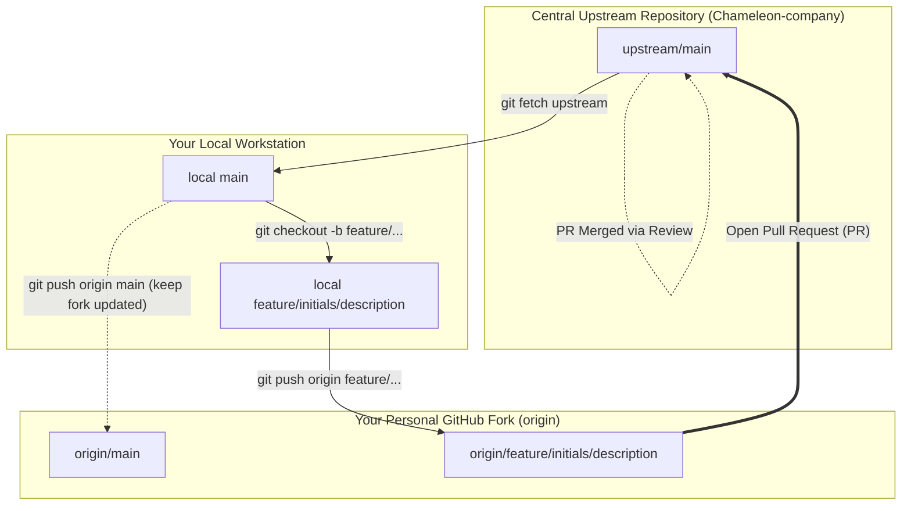
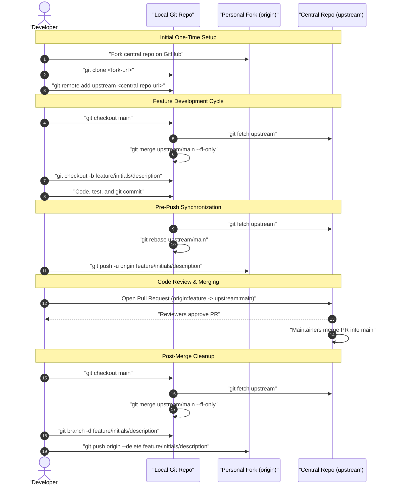

# GitHub Forking Strategy & Collaboration Guide

This document outlines the standard Git and GitHub workflow for the **Victoria Urban Planning (Chameleon Project)** team. All contributors across all streams must follow this **Forking Strategy + Feature Branch Pattern** to maintain repository integrity, ensure peer-reviewed code quality, and prevent integration conflicts.

---

## Table of Contents
1. [Workflow Overview](#workflow-overview)
2. [Git Architecture & Remotes](#git-architecture--remotes)
3. [One-Time Initial Setup](#one-time-initial-setup)
4. [Step-by-Step Developer Workflow](#step-by-step-developer-workflow)
   - [Step 1: Sync Local `main` with `upstream/main`](#step-1-sync-local-main-with-upstreammain)
   - [Step 2: Create a Feature Branch](#step-2-create-a-feature-branch)
   - [Step 3: Develop, Test, and Commit](#step-3-develop-test-and-commit)
   - [Step 4: Fetch and Rebase Against `upstream/main`](#step-4-fetch-and-rebase-against-upstreammain)
   - [Step 5: Push Feature Branch to Your Fork (`origin`)](#step-5-push-feature-branch-to-your-fork-origin)
   - [Step 6: Open a Pull Request (PR)](#step-6-open-a-pull-request-pr)
   - [Step 7: Address Review Feedback](#step-7-address-review-feedback)
   - [Step 8: Post-Merge Cleanup](#step-8-post-merge-cleanup)
5. [Branch Naming & Commit Conventions](#branch-naming--commit-conventions)
6. [Conflict Resolution Guide](#conflict-resolution-guide)
7. [Troubleshooting & FAQs](#troubleshooting--faqs)

---

## Workflow Overview

To ensure clean isolation and safe collaboration among 30+ contributors, our repository uses the **GitHub Forking Workflow** combined with the **Feature Branch Pattern**:

1. **Central Upstream Repository (`upstream`):** The authoritative repository (`Chameleon-company/Victoria-Urban-Planning`). Direct commits and unreviewed branch pushes are restricted.
2. **Personal Fork (`origin`):** Each developer creates their own copy of the repository under their personal GitHub account (`<your-username>/Victoria-Urban-Planning`).
3. **Local Workspace:** Developers work on isolated feature branches within their local workstation, keeping their local `main` synchronized with `upstream/main`.
4. **Pull Requests (PRs):** Contributions are proposed from the developer's forked feature branch to `upstream/main`, where they undergo peer review and validation checks.

---

## Git Architecture & Remotes

The relationship between your local machine, your personal GitHub fork, and the central upstream repository is structured as follows:



### Remote Definitions
| Remote Name | Target URL | Description |
| :--- | :--- | :--- |
| `origin` | `https://github.com/<your-username>/Victoria-Urban-Planning.git` | Your personal fork on GitHub (read/write) |
| `upstream` | `https://github.com/Chameleon-company/Victoria-Urban-Planning.git` | The central team repository (read-only for daily feature work) |

---

## Sequence Workflow

The interaction sequence for developing a feature, syncing upstream changes, and submitting a pull request is illustrated below:



---

## One-Time Initial Setup

Follow these steps once when setting up your development environment:

### 1. Fork the Repository on GitHub
1. Navigate to the central repository: `https://github.com/Chameleon-company/Victoria-Urban-Planning`
2. Click the **Fork** button in the top-right corner.
3. Select your personal GitHub account as the owner and click **Create fork**.

### 2. Clone Your Fork Locally
Clone your newly created fork to your local computer:

```bash
git clone https://github.com/<your-github-username>/Victoria-Urban-Planning.git
cd Victoria-Urban-Planning
```

### 3. Add the Upstream Remote
Configure the central repository as the `upstream` remote:

```bash
git remote add upstream https://github.com/Chameleon-company/Victoria-Urban-Planning.git
```

### 4. Verify Your Remote Configuration
Confirm that both `origin` and `upstream` are properly set:

```bash
git remote -v
```

**Expected output:**
```text
origin    https://github.com/<your-username>/Victoria-Urban-Planning.git (fetch)
origin    https://github.com/<your-username>/Victoria-Urban-Planning.git (push)
upstream  https://github.com/Chameleon-company/Victoria-Urban-Planning.git (fetch)
upstream  https://github.com/Chameleon-company/Victoria-Urban-Planning.git (push)
```

---

## Step-by-Step Developer Workflow

Follow this cycle for every new task, bug fix, or notebook contribution.

### Step 1: Sync Local `main` with `upstream/main`
Before starting any new work, ensure your local `main` branch is identical to the latest upstream version:

```bash
# Switch to main branch
git checkout main

# Fetch the latest commits from upstream
git fetch upstream

# Fast-forward your local main branch
git merge upstream/main --ff-only

# (Optional) Push the updated main branch to your personal fork
git push origin main
```

---

### Step 2: Create a Feature Branch
Within your local clone, always create a descriptive feature branch from the updated `main`:

```bash
git checkout -b feature/<your-initials>/<short-description>
```

*Example:*
```bash
git checkout -b feature/sz/parking-occupancy-aggregation
```

> [!IMPORTANT]
> **Never develop directly on the `main` branch.** All changes must be isolated in dedicated feature or bugfix branches.

---

### Step 3: Develop, Test, and Commit
Write your code, execute test suites, or run notebooks. Adhere strictly to the project [Coding Standards](CODING_STANDARDS.md).

```bash
# Stage your changes
git add src/api/routes/occupancy.py frontend/src/components/OccupancyChart.jsx

# Commit with a clear, imperative message
git commit -m "feat(api): add hourly parking occupancy aggregation endpoint"
```

> [!CAUTION]
> **Check before committing:**
> - Ensure no API keys, secrets, or passwords are staged (`.env` must remain gitignored).
> - Never use absolute filesystem paths (e.g., `/Users/...` or `C:\...`).
> - Ensure notebooks are executed sequentially and cleared of transient debug dumps.

---

### Step 4: Fetch and Rebase Against `upstream/main`
Before pushing your branch, integrate any changes merged into `upstream/main` by other teammates. Rebasing ensures a linear, clean commit history without unnecessary merge commits:

```bash
# Fetch latest changes from central upstream
git fetch upstream

# Rebase your feature branch on top of upstream main
git rebase upstream/main
```

If there are no conflicts, Git completes the rebase smoothly. If conflicts arise, follow the [Conflict Resolution Guide](#conflict-resolution-guide).

---

### Step 5: Push Feature Branch to Your Fork (`origin`)
Push your local feature branch to your personal GitHub fork:

```bash
git push -u origin feature/<your-initials>/<short-description>
```

> [!NOTE]
> If you have already pushed your branch earlier and then performed a rebase, use `--force-with-lease` to safely update your remote fork:
> ```bash
> git push --force-with-lease origin feature/<your-initials>/<short-description>
> ```

---

### Step 6: Open a Pull Request (PR)
1. Open your browser and go to `https://github.com/Chameleon-company/Victoria-Urban-Planning`.
2. GitHub will automatically display a banner prompting **"Compare & pull request"**. Alternatively, go to the **Pull Requests** tab and click **New Pull Request**.
3. Verify the branch comparison targets:
   - **Base repository:** `Chameleon-company/Victoria-Urban-Planning` | **base:** `main`
   - **Head repository:** `<your-username>/Victoria-Urban-Planning` | **compare:** `feature/<your-initials>/<short-description>`
4. Complete the PR template checklist (`.github/PULL_REQUEST_TEMPLATE.md`).
5. Assign at least one reviewer from your stream.

---

### Step 7: Address Review Feedback
When reviewers request modifications:
1. Make the necessary edits on your local feature branch.
2. Stage and commit your updates:
   ```bash
   git add <modified-files>
   git commit -m "refactor: apply reviewer feedback on spatial buffer radius"
   ```
3. Fetch and rebase on `upstream/main` if new commits have landed:
   ```bash
   git fetch upstream
   git rebase upstream/main
   ```
4. Push the changes to your fork:
   ```bash
   git push origin feature/<your-initials>/<short-description>
   ```
   *(Or `git push --force-with-lease origin feature/<your-initials>/<short-description>` if rebased)*.

GitHub will automatically update the open Pull Request.

---

### Step 8: Post-Merge Cleanup
Once your PR has been approved and merged into `upstream/main`:

```bash
# Switch back to main
git checkout main

# Fetch and fast-forward local main to include your merged work
git fetch upstream
git merge upstream/main --ff-only

# Push updated main to your fork
git push origin main

# Delete the local feature branch
git branch -d feature/<your-initials>/<short-description>

# Delete the remote feature branch on your fork
git push origin --delete feature/<your-initials>/<short-description>
```

---

## Branch Naming & Commit Conventions

### Branch Naming Patterns
| Category | Prefix Pattern | Example |
| :--- | :--- | :--- |
| **New Features** | `feature/<initials>/<description>` | `feature/sz/bike-lane-buffers` |
| **Bug Fixes** | `bugfix/<initials>/<description>` | `bugfix/sz/fix-crs-reprojection` |
| **Documentation** | `docs/<initials>/<description>` | `docs/sz/update-git-workflow` |
| **Refactoring** | `refactor/<initials>/<description>` | `refactor/sz/duckdb-query-optim` |

### Commit Message Guidelines
Follow conventional commit styling for clean project logs:
- `feat: <description>` for new functional features
- `fix: <description>` for bug fixes
- `docs: <description>` for documentation updates
- `refactor: <description>` for non-functional code restructurings
- `test: <description>` for adding or updating tests

*Example:* `feat(ingestion): implement dynamic monthly bay capacity engine`

---

## Conflict Resolution Guide

When running `git rebase upstream/main`, Git may pause if incoming upstream changes touch the same lines of code:

```text
Auto-merging src/config.py
CONFLICT (content): Merge conflict in src/config.py
error: could not apply 3a7f82b... Add dynamic buffer settings
Resolve all conflicts manually, mark them as resolved with "git add <paths>",
then run "git rebase --continue".
```

### Steps to Resolve:
1. **Locate Conflicted Files:**
   Run `git status` to see all unmerged paths.
2. **Open and Edit Conflicts:**
   Open the affected files in your editor. Look for Git conflict markers:
   ```text
   <<<<<<< HEAD (Current upstream code)
   DEFAULT_BUFFER_RADIUS_METERS = 25
   =======
   DEFAULT_BUFFER_RADIUS_METERS = 20
   >>>>>>> feature/sz/bike-lane-buffers (Your commit)
   ```
3. **Resolve the Code:**
   Choose the correct logic, combine improvements where necessary, and delete all conflict markers (`<<<<<<<`, `=======`, `>>>>>>>`).
4. **Stage the Resolved Files:**
   ```bash
   git add src/config.py
   ```
5. **Continue the Rebase:**
   ```bash
   git rebase --continue
   ```
   *(Repeat if Git pauses on subsequent commits)*.
6. **Abort if Needed:**
   If the rebase becomes tangled and you want to restore your branch to its prior state:
   ```bash
   git rebase --abort
   ```

---

## Troubleshooting & FAQs

### Q1: I accidentally committed work directly to my local `main` branch. How do I move it to a feature branch?
If you haven't pushed `main` yet:
```bash
# Create a new feature branch holding your unpushed commits
git checkout -b feature/<your-initials>/my-work

# Switch back to main
git checkout main

# Reset main back to match upstream/main
git fetch upstream
git reset --hard upstream/main
```

### Q2: Why should I use `git push --force-with-lease` instead of `git push --force`?
`--force-with-lease` is a safer alternative to `--force`. It only overwrites the remote branch if nobody else (such as a collaborator or CI bot) has pushed additional commits to that branch in the meantime, protecting against accidental work deletion.

### Q3: My local repository doesn't have an `upstream` remote.
Add it anytime using:
```bash
git remote add upstream https://github.com/Chameleon-company/Victoria-Urban-Planning.git
git remote -v
```

### Q4: How do I sync all branches in my GitHub fork web UI?
On your fork's GitHub repository page (`https://github.com/<your-username>/Victoria-Urban-Planning`), click the **Sync fork** button and select **Update branch**. However, the CLI method (`git fetch upstream && git merge upstream/main --ff-only`) is recommended for direct local synchronization.
