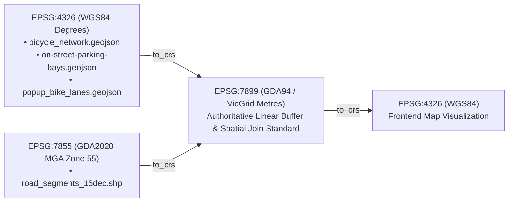
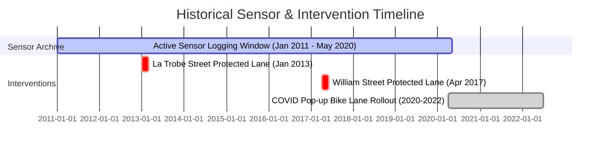
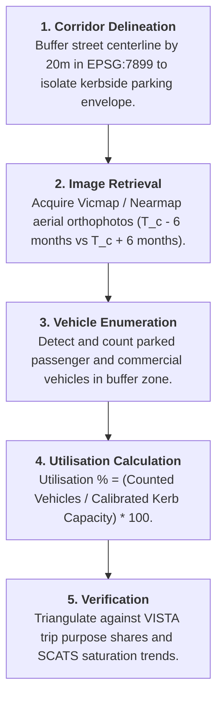

# Victoria Urban Planning - Master Dataset Inventory

**Stream 2: Traffic Volumes & Parking (Team B)**  
Urban Streetscape Intervention Analysis (USIA)  
Infrastructure Victoria & SIT Capstone (Chameleon Project)  
August 2026 | Technical Data Architecture & Schema Catalog

---

## 1. Overview & Data Acquisition Process

This document provides a comprehensive inventory of all empirical datasets, telemetry streams, spatial vector layers, and econometric panels integrated across the Team B Urban Analytics research suite.

### Discovery & Harmonization Methodology
1. **Multi-Source Discovery:** Audited and cataloged open-access feeds across the Victorian Government Data Directory ([DataVic](https://discover.data.vic.gov.au/)), Open Data Transport Victoria, City of Melbourne Open Data Portal, Geelong Data Exchange, and the Open-Meteo Historical Weather API.
2. **Authoritative Ground Truth Integration:** Incorporated Infrastructure Victoria (IV) master site databases (`sites_db.csv`) and the 105-quarter longitudinal panel (`street_segment_qtr_attributes.csv`) covering 315 treatment and control street segments (1999–2025).
3. **Temporal Window & Sensor Usability Auditing:** Cross-referenced intervention dates against active IoT sensor archives (Jan 2011 – May 2020) and developed aerial orthophoto proxy frameworks for non-sensor municipalities.
4. **Spatial CRS Harmonization:** Standardized all vector geometries on the official Victorian analysis coordinate system **EPSG:7899 (GDA94 / VicGrid)**.

---

## 2. Complete Data Catalog & Schema Reference

### 2.1 Cycling Infrastructure & Street Interventions

| Dataset Name | Source / Endpoint | Spatial Coverage | Temporal Span | Native CRS | Key Columns & Schema | Analytical Application |
| :--- | :--- | :--- | :--- | :--- | :--- | :--- |
| **Bicycle Infrastructure Network (BIN)** | [Transport Victoria](https://opendata.transport.vic.gov.au/) | Statewide Victoria (55,705 features) | Current / Regular Updates | `EPSG:7899` / `EPSG:4326` | `objectid`, `roadclass`, `description`, `geometry` (LineString/MultiLineString) | Identifies bicycle corridors, infrastructure types (protected on-road, painted lane, shared path), and network lengths. |
| **Pop-up Bike Lanes Network** | [DataVic](https://discover.data.vic.gov.au/) | Greater Melbourne (354 segments, 109 roads) | May 2020 – Jul 2022 | `EPSG:4326` | `roadnm`, `side`, `trialdate`, `postdate`, `lga`, `trialinfra`, `postinfra`, `geometry` | Evaluates COVID-19 rapid deployment cycling trials, retention rates (32.2% permanent), and municipal outcomes. |
| **Strategic Cycling Corridors (SCC)** | [DataVic](https://discover.data.vic.gov.au/) | Statewide Victoria | Planning horizon | `EPSG:7899` | `corridor_id`, `route_name`, `hierarchy`, `geometry` | Benchmark against state priority cycling trunk routes. |

---

### 2.2 Multi-Modal Traffic Flow, Vehicle Classification & Telemetry

| Dataset Name | Source / Endpoint | Record Volume | Temporal Span | Resolution | Key Columns & Metrics | Analytical Application |
| :--- | :--- | :--- | :--- | :--- | :--- | :--- |
| **SCATS Traffic Signal Volumes** | VicRoads / DataVic | ~120M readings (8.55M site-hours) | 2018 – 2024 | 15-minute intervals | `NB_SCATS_SITE`, `QT_INTERVAL_COUNT`, `V00`..`V95`, `CT_ALARM_24HOUR` | Arterial vehicular flow, intersection capacity, degree of saturation, detector fault filtering (`-1` sentinels). |
| **TIRTL Infrared Traffic Logger** | Transport Victoria | 211.28M rows (3.61B vehicle counts) | Jan – Aug 2026 | 15-minute intervals | `site`, `date`, `time_bin`, `heading`, `vehicle_class` (0–14), `speed_bin`, `volume` | Freight and commercial vehicle classification: Class 1 light cars (85.8%), Class 3 rigid trucks (10.1%), Class 9 heavy articulated (1.7%). |
| **Transport Activity Counts** | Melbourne Open Data Portal | 22.35M rows (167 sensor lines) | 2023 – May 2026 | 5-minute intervals | `countLocationId`, `class` (14 classes), `count`, `from`, `to`, `year`, `quarter` | Street activity breakdown: Pedestrians (68.1%), Private cars (27.5%), Cyclists & micromobility (10.7%), Freight/Buses (3.3%). |
| **Permanent Telemetry Vehicle Counters** | Transport Victoria | Continuous hourly counters | Multi-year historical | Hourly / Daily | `site_id`, `timestamp`, `lane_number`, `volume`, `speed` | Freeway and regional highway traffic volume benchmarking (0 CBD sites; nearest 20.7km). |

---

### 2.3 Parking Inventories, Sensors & Transactional Archives

| Dataset Name | Source / Endpoint | Record Volume | Temporal Span | Native Schema | Analytical Application |
| :--- | :--- | :--- | :--- | :--- | :--- |
| **On-Street Parking Bays (Spatial)** | Melbourne Open Data Portal | 29,053 marked bay polygons | Current snapshot | `bay_id`, `roadsegmentdescription`, `marker_id`, `geometry` (Point/Polygon) | Spatial snapping of parking bays to street centerlines and bike lane buffers. |
| **Live Parking Bay Sensor API** | Melbourne Open Data Portal | 6,324 active sensors | Real-time snapshots | `bay_id`, `lastupdated`, `status_timestamp`, `zone_number`, `status_description` (`Present` vs `Unoccupied`) | Real-time parking pressure scoring, hotspot identification, and sensor staleness detection (>2 days stuck). |
| **Historical Parking Sensor Event Archives** | OpenDataSoft S3 Bucket Archives | 180.8M+ event rows (2011–2020) | Jan 2011 – May 2020 | `DeviceId`, `ArrivalTime`, `DepartureTime`, `DurationSeconds`, `StreetName`, `BetweenStreet1`, `BetweenStreet2` | Longitudinal parking occupancy, stay duration distribution (mean 31.8–31.9 min), and turnover calculations. |
| **Geelong Smart Parking Sensor Stream** | Geelong Data Exchange | Real-time & recent history | 2020 – Present | `device_id`, `bay_id`, `status`, `timestamp` | IoT parking sensor validation for regional city center. |

---

### 2.4 Longitudinal Econometric Panels & Spatial Boundaries

| Dataset Name | Source / Provider | Format / Dimensions | Temporal Coverage | Key Fields | Description |
| :--- | :--- | :--- | :--- | :--- | :--- |
| **Master Sites Database (`sites_db.csv`)** | Infrastructure Victoria | 637 segments, 35 cols (`cp1252`) | 2009 – 2025 | `StreetSegmentID`, `SiteID`, `SiteType`, `InterventionType`, `DisruptionStartDate`, `DisruptionEndDate`, `DateOfIntervention` | Authoritative master directory of all treatment and control sites, disruption dates, and baseline attributes. |
| **Quarterly Attributes Panel (`street_segment_qtr_attributes.csv`)** | Infrastructure Victoria | 30,782 records, 15 cols | 105 quarters (FY1999-00 Q2 to FY2025-26 Q2) | `STREET_SEGMENT_ID`, `QUARTER` (`YYZZQn`), `StreetInScopeOnStreetParkingCap`, `InterventionType`, `InterventionSummary` | Econometric panel for Difference-in-Differences analysis; requires segment-scoped down/up filling. |
| **Study Streets Spatial Centerlines (`streets_spatial.gpkg`)** | Infrastructure Victoria | 315 line features (`EPSG:7899`) | Baseline 2018 | `street_segment_id` (Int64), `street_name`, `suburb`, `lga`, `treatment_or_control`, `intervention_type` | 219 control segments, 96 treatment segments (80 protected bike lanes, 10 regional, 6 pedestrianisation). |
| **Study Area Buffer Polygons (`street_spatial_study_area.gpkg`)** | Infrastructure Victoria | 316 buffer polygons (`EPSG:7899`) | Baseline 2018 | `street_segment_id`, `geometry` (MultiPolygon ~250m catchment buffer) | 316 features; segment ID 3500 is unique to study area polygons. |
| **Greater Melbourne Road Network (`road_segments_15dec.shp`)** | Vicmap Roads / DOT | 12,035 line features (`EPSG:7855`) | Dec 2024 update | `street_seg`, `street_nam`, `ROAD_TYPE`, `CLASS_CODE`, `length_km` (40.3% null) | Comprehensive background road network; requires reprojection to `EPSG:7899`. |

---

### 2.5 Exogenous Confounders: Meteorological Telemetry

| Dataset Name | Source / Endpoint | Spatial Coordinates | Temporal Span | Resolution | Key Columns | Analytical Application |
| :--- | :--- | :--- | :--- | :--- | :--- | :--- |
| **Historical Weather Telemetry** | [Open-Meteo Historical Weather API](https://archive-api.open-meteo.com/v1/archive) | Melbourne CBD (`-37.8136`, `144.9631`) | Hourly (2011 – 2026) | Hourly intervals | `temperature_2m` (°C), `precipitation` (mm), `wind_speed_10m` (km/h), `weather_code` | Exogenous control variable in parking and active transport regressions (controls for rain-induced modal shift). |

---

## 3. Coordinate Reference System (CRS) Transformation Matrix

To eliminate spatial join distortions, all datasets are transformed into the authoritative Victorian state projection:

| Source Layer | Original CRS | Target CRS | Transformation Method | Resolves |
| :--- | :--- | :--- | :--- | :--- |
| `bicycle_network.geojson` | `EPSG:4326` | `EPSG:7899` | `gdf.to_crs(epsg=7899)` | Metric buffering (20m corridor buffer) without angular degree errors. |
| `popup_bike_lanes.geojson` | `EPSG:4326` | `EPSG:7899` | `gdf.to_crs(epsg=7899)` | Accurate distance queries against street centrelines. |
| `road_segments_15dec.shp` | `EPSG:7855` | `EPSG:7899` | `gdf.to_crs(epsg=7899)` | Fixes spatial offset between state road shapefile and IV geopackages. |
| `on_street_parking_bays.geojson` | `EPSG:4326` | `EPSG:7899` | `gdf.to_crs(epsg=7899)` | Nearest-neighbor bay centroid snapping ($\le 25\text{m}$). |

---

## 4. Sensor Usability & Temporal Analysis Windows

The City of Melbourne historical parking sensor archive operates from **January 2011 to May 2020**:

### Usability Rules for Before/After Analysis:
1. **Sensor-Usable Corridors ($n=11$ treatment segments):** Corridors whose construction date occurred within the sensor window with $\ge 180\text{ days}$ of pre- and post-intervention data (e.g., William St April 2017, La Trobe St January 2013).
2. **Baseline-Only Corridors ($n=4$ segments):** Interventions delivered in mid/late 2020 (Peel St July 2020, Exhibition St October 2020) possess pre-intervention sensor baselines but require aerial imagery proxies for post-intervention evaluation.
3. **Aerial-Proxy Corridors ($n=81$ segments):** Interventions outside the City of Melbourne (Yarra, Port Phillip, Merri-bek, Geelong, Ballarat) or delivered after May 2020 evaluated via the Aerial Orthophoto Proxy framework.

---

## 5. Remote Sensing Aerial Orthophoto Proxy Methodology

For municipalities without in-ground parking sensors, parking utilization is evaluated using multi-temporal aerial photography:

---

## 6. Data Integrity & Cleansing Standards

Across all ingestion scripts, the following automated data quality rules are strictly enforced:
1. **Financial-Year Quarter Decoding:** Parsing `YYZZQn` codes accurately (`1819Q1` $\to$ `2018-07-01`, avoiding calendar 6-month shifts).
2. **Sentinel Fault Cleansing:** Scrubbing `-1` detector fault codes from SCATS and TIRTL feeds.
3. **Sensor Duration Bounding:** Dropping records where `DurationSeconds <= 0` or `DurationSeconds > 86400`.
4. **Kerbside Obstruction Imputation:** Imputing missing nominal capacities using the calibrated factor $k = 0.428 \times \text{cap\_geometric}$.
5. **No Synthetic / Dummy Data in Production:** All analytical views and feature marts are populated directly from verified empirical datasets.
