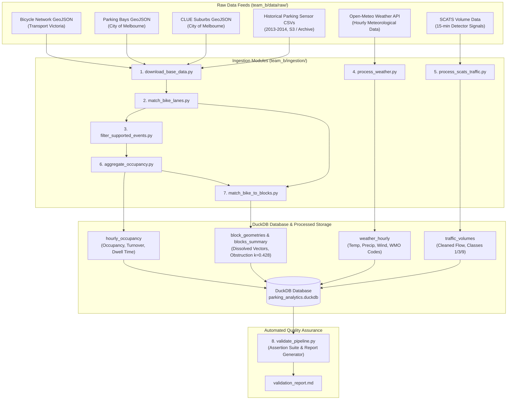

# Victoria Urban Planning - Ingestion & Data Curation Pipeline

**Stream 2: Traffic Volumes & Parking (Team B)**  
Urban Streetscape Intervention Analysis (USIA)  
Infrastructure Victoria & SIT Capstone (Chameleon Project)  
August 2026 | Technical Pipeline Documentation

---

## 1. Pipeline Architecture & Orchestration

The end-to-end data pipeline is centrally orchestrated by [`team_b/run_ingestion.py`](../team_b/run_ingestion.py). It cleans, normalizes, spatializes, and aggregates multi-gigabyte raw datasets into an analytical DuckDB database ([`team_b/data/parking_analytics.duckdb`](../team_b/data/parking_analytics.duckdb)) and compressed Parquet feature marts.



---

## 2. Ingestion Modules & Processing Steps

### Step 1: Base Data Downloader & Stream Initializer
- **Script:** [`team_b/ingestion/download_base_data.py`](../team_b/ingestion/download_base_data.py)
- **Functions:** Downloads base GeoJSON layers (`bicycle_network.geojson`, `on_street_parking_bays.geojson`, `suburbs.geojson`) and historical parking sensor event archives from S3.

### Step 2: Spatial Matcher & CRS Harmonization
- **Script:** [`team_b/ingestion/match_bike_lanes.py`](../team_b/ingestion/match_bike_lanes.py)
- **Functions:** Reprojects spatial layers to **EPSG:7899 (VicGrid)**, filters active infrastructure line segments, intersects 20m buffered parking bays with bike lanes, and filters corridors with $\ge 10$ bays. Outputs `matched_bike_segments.geojson` and `matched_parking_bays.geojson`.

### Step 3: High-Volume Event Filtering
- **Script:** [`team_b/ingestion/filter_supported_events.py`](../team_b/ingestion/filter_supported_events.py)
- **Functions:** Streams multi-gigabyte raw parking sensor CSVs via DuckDB out-of-core queries, filtering on supported streets, dropping non-positive durations, and writing compressed Parquet files (`matched_events_2013.parquet`, `matched_events_2014.parquet`).

### Step 4: Weather Telemetry Ingestion
- **Script:** [`team_b/ingestion/process_weather.py`](../team_b/ingestion/process_weather.py)
- **Functions:** Ingests hourly meteorological telemetry for Melbourne CBD (temperature, precipitation, wind speed, WMO weather codes) from Open-Meteo Historical Weather API into DuckDB table `weather_hourly`.

### Step 5: SCATS Traffic Signal & Vehicle Classification Processing
- **Script:** [`team_b/ingestion/process_scats_traffic.py`](../team_b/ingestion/process_scats_traffic.py)
- **Functions:** Ingests 15-minute SCATS traffic counts, cleans negative sentinel detector fault codes (`-1`), calculates vehicle classification proportions (Class 1 light cars, Class 3 rigid trucks, Class 9 articulated heavy vehicles), and populates `traffic_volumes`.

### Step 6: Hourly Occupancy, Turnover & Stay Duration Aggregation
- **Script:** [`team_b/ingestion/aggregate_occupancy.py`](../team_b/ingestion/aggregate_occupancy.py)
- **Functions:** Slices parking events across discrete clock hours, cleans duration anomalies ($<0$s or $>24$h), computes active bay capacity per month, and derives hourly occupancy rate, event counts, turnover rate ($\text{events}/\text{bays}$), and average dwell duration. Populates table `hourly_occupancy`.

### Step 7: Block Mapping, Kerbside Obstruction Calibration & Summary
- **Script:** [`team_b/ingestion/match_bike_to_blocks.py`](../team_b/ingestion/match_bike_to_blocks.py)
- **Functions:** Dissolves block-level bike segment geometries into unified GeoJSON features (`block_geometries`), calibrates kerbside capacity using the empirical obstruction ratio ($k = 0.428$), computes before/after occupancy changes, and builds `blocks_summary`.

### Step 8: Automated Data Quality Suite
- **Script:** [`team_b/ingestion/validate_pipeline.py`](../team_b/ingestion/validate_pipeline.py)
- **Functions:** Executes data quality assertions on non-null keys, occupancy bounds $[0.0, 1.0]$, valid traffic volumes, valid weather ranges, and generates [`team_b/data/processed/validation_report.md`](../team_b/data/processed/validation_report.md).

---

## 3. Database Schema Reference

The DuckDB database ([`team_b/data/parking_analytics.duckdb`](../team_b/data/parking_analytics.duckdb)) contains five optimized tables:

### 3.1 `blocks_summary`
Master summary table storing before-and-after intervention metrics for all monitored street blocks.

```sql
CREATE TABLE blocks_summary (
    suburb VARCHAR,
    street_name VARCHAR,
    block_desc VARCHAR,
    geom_json VARCHAR,
    baseline_bays INTEGER,
    final_bays INTEGER,
    bays_removed INTEGER,
    pre_occupancy DOUBLE,
    post_occupancy DOUBLE,
    occupancy_change_pp DOUBLE,
    pre_turnover DOUBLE,
    post_turnover DOUBLE,
    obstruction_factor DOUBLE,
    estimated_capacity_loss DOUBLE
);
```

### 3.2 `hourly_occupancy`
Transactional hourly occupancy, turnover, and dwell duration time series.

```sql
CREATE TABLE hourly_occupancy (
    year INTEGER,
    suburb VARCHAR,
    street_name VARCHAR,
    block_desc VARCHAR,
    hr TIMESTAMP,
    occupied_minutes DOUBLE,
    total_minutes DOUBLE,
    occupancy_rate DOUBLE,
    bay_count INTEGER,
    events_count INTEGER,
    turnover_rate DOUBLE,
    avg_duration_min DOUBLE
);
```

### 3.3 `weather_hourly`
Hourly meteorological telemetry for controlling weather-induced transport shifts.

```sql
CREATE TABLE weather_hourly (
    timestamp TIMESTAMP,
    temperature_2m DOUBLE,
    precipitation DOUBLE,
    wind_speed_10m DOUBLE,
    weather_code INTEGER,
    weather_condition VARCHAR
);
```

### 3.4 `traffic_volumes`
15-minute SCATS traffic flows, degrees of saturation, and vehicle classification estimates.

```sql
CREATE TABLE traffic_volumes (
    timestamp TIMESTAMP,
    intersection_id INTEGER,
    traffic_volume INTEGER,
    degree_of_saturation DOUBLE,
    vol_class_1_light INTEGER,
    vol_class_3_truck INTEGER,
    vol_class_9_heavy INTEGER,
    fault_flag INTEGER
);
```

### 3.5 `block_geometries`
Dissolved vector geometries stored as GeoJSON strings for high-performance map rendering.

```sql
CREATE TABLE block_geometries (
    suburb VARCHAR,
    street_name VARCHAR,
    block_desc VARCHAR,
    geom_json VARCHAR
);
```

---

## 4. Key Data Cleansing & Normalization Rules

1. **Street Name Symmetrical Normalization:**
   ```python
   def normalize(name: str) -> str:
       name = str(name).upper().strip()
       name = re.sub(r'\s+', ' ', name)
       name = name.replace("LITTLE ", "LT ")
       name = name.replace("SAINT ", "ST ")
       return name
   ```
2. **Alphabetical Cross-Street Keying:** Sorter ensures `"BETWEEN QUEEN ST AND ELIZABETH ST"` and `"BETWEEN ELIZABETH ST AND QUEEN ST"` resolve to the identical unique block key.
3. **Sensor Duration Cleansing:** Sessions with $\text{DurationSeconds} \le 0$ or $\text{DurationSeconds} > 86400$ are purged to eliminate sensor clock reversals and midnight server backfill errors.
4. **SCATS Sentinel Elimination:** Negative volume values ($<0$) are scrubbed and tagged with `fault_flag = 1`.
5. **Calibrated Capacity Modeling:** In accordance with Grattan Institute Appendix D and empirical testing, nominal capacity is modeled as:
   $$\text{Capacity} = \left(\frac{\text{Kerb Length (m)}}{\text{Space Length (m)}}\right) \times 0.428$$
