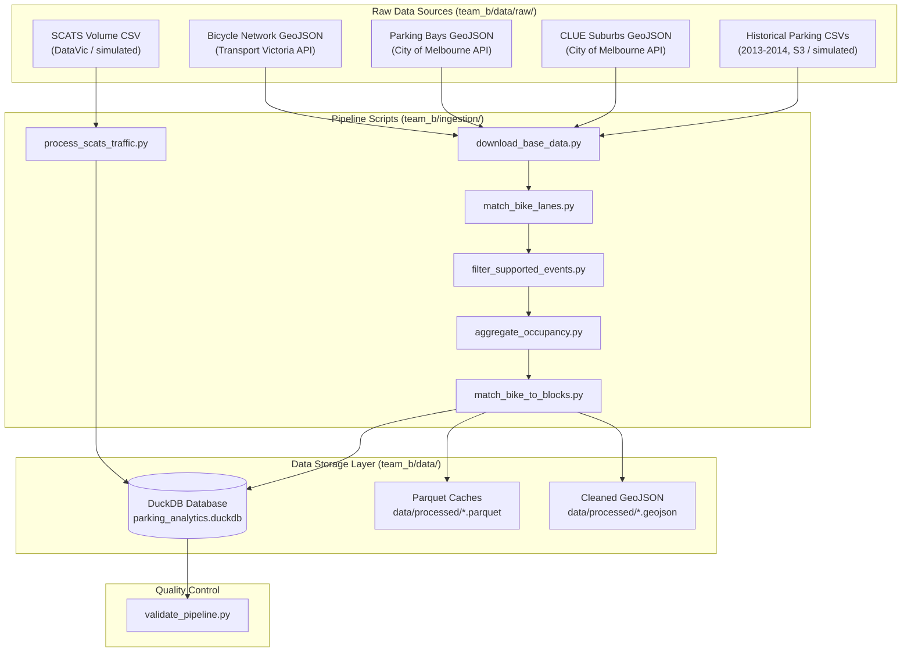

# Data Curation & Ingestion Pipeline

Documentation for the data ingestion and curation pipeline used to build the database for the Victoria Urban Planning dashboard. The pipeline cleans, normalizes, and joins raw geospatial data and parking sensor events.

---

## Pipeline Architecture

The end-to-end pipeline is orchestrated by [team_b/run_ingestion.py](../team_b/run_ingestion.py) and executes the ETL steps in sequence.

### ETL Scripts

1. **[`download_base_data.py`](../team_b/ingestion/download_base_data.py)**: Downloads base GeoJSON files (bicycle network, parking bays, suburbs). If S3 downloads for 2013-2014 historical parking sensor CSVs fail, it falls back to simulating event files locally.
2. **[`match_bike_lanes.py`](../team_b/ingestion/match_bike_lanes.py)**: Projects spatial vector layers, standardizes coordinates, performs spatial joins, and filters out streets with fewer than 10 bays.
3. **[`filter_supported_events.py`](../team_b/ingestion/filter_supported_events.py)**: Streams the large raw CSV events through DuckDB to extract events matching our supported streets, saving the output as compressed Parquet files.
4. **[`process_scats_traffic.py`](../team_b/ingestion/process_scats_traffic.py)**: Ingests historical SCATS volume records or generates simulated 15-minute traffic flows at intersections.
5. **[`aggregate_occupancy.py`](../team_b/ingestion/aggregate_occupancy.py)**: Aggregates raw events into hourly occupancy percentages using DuckDB window functions, calculating dynamic monthly capacity.
6. **[`match_bike_to_blocks.py`](../team_b/ingestion/match_bike_to_blocks.py)**: Groups bike lanes by block, dissolves linear geometries for map visualization, and creates the blocks summary tables.
7. **[`validate_pipeline.py`](../team_b/ingestion/validate_pipeline.py)**: Performs final integrity checks and writes a validation report to [validation_report.md](../team_b/data/processed/validation_report.md).

---

## Source Datasets

- **Bicycle Infrastructure Network (BIN)**: Linear street geometries for cycling infrastructure.
- **On-Street Parking Bays**: Coordinates of individual parking spaces.
- **CLUE Suburbs**: Boundary geometries for City of Melbourne suburbs (Carlton, Melbourne CBD, etc.).
- **Historical Parking Sensors**: Timestamped arrival and departure event logs from in-ground sensors.
- **SCATS Traffic Volumes**: Historical vehicle throughput volumes at intersections.

---

## Data Cleaning & Transformations

### 1. Coordinate Reprojection
Raw datasets are provided in WGS 84 (`EPSG:4326`). For accurate spatial joins and buffering (e.g., matching lanes to parking bays), vector layers are projected to GDA2020 / VicGrid (`EPSG:7899`). Geometries are reprojected back to WGS 84 before exporting for web visualization.

### 2. Network Graph Cleanup
The raw Bicycle Infrastructure Network (BIN) contains virtual routing lines (e.g., connectors across intersections or property entrances). These are filtered out by stripping segment descriptions that lack active infrastructure keywords (like 'lane', 'path', 'segregated') and keeping only valid `LineString` or `MultiLineString` shapes. Bays/sensors directly at intersections (labeled `Intersection of...`) are also excluded.

### 3. Spatial Joins & Street Constraints
- **Proximity Buffering**: Bike lanes are buffered by 20m and intersected with parking bays.
- **Significance Threshold**: Streets are completely excluded from the dataset unless they contain at least 10 on-street parking bays directly intersecting the bike lane buffer.
- **Suburb Border Collision Fix**: Border streets (like Victoria Street or Spring Street) have parking bays split between adjacent suburbs. Since the sensor event logs often associate the entire street with only one suburb, joining on suburb names drops valid events. To resolve this, the pipeline performs joins strictly on normalized street names and block descriptions, and then assigns the suburb labels using spatial containment geometries during the final build step.

### 4. High-Volume Transactional Filtering
The raw City of Melbourne historical parking sensor dataset contains over 80 million rows per year. To avoid memory bottlenecks, we use DuckDB's `read_csv_auto` streaming with pushdown predicate filtering on supported streets, dropping records with missing arrival/departure times or `DurationSeconds <= 0`.

### 5. Street Name Normalization
To prevent join misses between datasets (e.g., spatial bays spelling out `Little Lonsdale Street` vs sensor logs spelling `Lt LONSDALE STREET`), street names are cleaned symmetrically:
- Stripped of extra spaces and converted to uppercase.
- Abbreviations are normalized:
  - `LITTLE` $\to$ `LT`
  - `SAINT` $\to$ `ST`
  - `STREET` $\to$ `ST`
  - `ROAD` $\to$ `RD`
  - `AVENUE` $\to$ `AVE`
  - `PARADE` $\to$ `PDE`
- Cross-streets (`between X and Y`) are sorted alphabetically to prevent block direction mismatches.

### 6. Metric Calculation & Occupancy Aggregation
- **Hourly Occupancy**: Calculated per hour window (0-23) by computing the minute overlap of active parking events: `SUM(LEAST(DepartureTime, hr_end) - GREATEST(ArrivalTime, hr_start))`.
- **Dynamic Capacity**: Parking bay capacity is calculated monthly per block as the maximum distinct number of broadcasting devices seen during that month. This accounts for offline sensors and closures.
- **Capping**: Occupancy rates are capped at `1.0` (100%) to mitigate sensor telemetry noise.
- **Geometry Dissolution**: Adjacent line segments sharing a block description are merged (unary union) to compress the GeoJSON output size by ~80%, improving map rendering performance.
