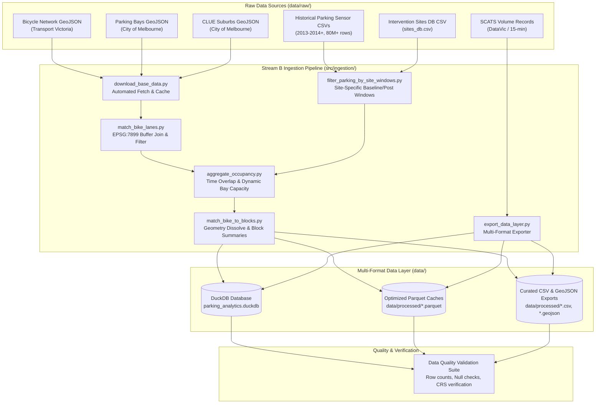

# Sprint 2 (Week 2) Task List — Stream B: Traffic Volumes & Parking

## 1. Executive Summary & Sprint 2 Objective

In Sprint 1, Stream B completed initial Exploratory Data Studies (EDS/EDA) exploring bicycle networks, City of Melbourne parking sensor records, site-specific disruption windows, SCATS traffic volumes, and aerial proxy methods.

The objective of **Sprint 2 (Week 2)** is to **consolidate and operationalize these research notebooks into production-grade, modular ingestion pipelines** housed under [`src/ingestion/`](../src/ingestion). The pipeline will ingest raw datasets, execute spatial joins and normalization, and persist clean data with flexible multi-format export capabilities (**DuckDB**, **Parquet**, and **CSV/GeoJSON**) to establish the foundational data layer for downstream API and UI development in Sprints 3 & 4.

---

## 2. EDA Inventory & Consolidation Mapping

The following Exploratory Data Studies checked into [`team_b/notebooks/`](../team_b/notebooks) are being consolidated into production modules:

| Notebook Source | Author | Core Findings & Methods | Target Production Module in `src/ingestion/` |
| :--- | :--- | :--- | :--- |
| [`00_data_ingestion.ipynb`](../team_b/notebooks/scott_z/00_data_ingestion.ipynb) | `scott_z` | End-to-end orchestration, DuckDB table creation, pipeline runner. | [`run_ingestion.py`](../run_ingestion.py) & [`src/config.py`](../src/config.py) |
| [`01_bike_lanes_eda.ipynb`](../team_b/notebooks/scott_z/01_bike_lanes_eda.ipynb) | `scott_z` | Bicycle Infrastructure Network (BIN) filtering, centroid connector removal, VicGrid EPSG:7899 spatial buffering (20m), bay intersection. | [`match_bike_lanes.py`](../src/ingestion/match_bike_lanes.py) |
| [`01_filter_parking_site_windows.ipynb`](../team_b/notebooks/gordon_t/01_filter_parking_site_windows.ipynb) | `gordon_t` | Parsing `sites_db.csv`, calculating dynamic pre/post window bounds around disruption/intervention anchors, SQL street normalization. | [`filter_parking_by_site_windows.py`](../src/ingestion/filter_parking_by_site_windows.py) |
| [`02_traffic_volumes_eda.ipynb`](../team_b/notebooks/scott_z/02_traffic_volumes_eda.ipynb) | `scott_z` | SCATS detector intervals, hourly AADT aggregation, turning movement analysis around intervention corridors. | `src/ingestion/process_scats_traffic.py` (New) |
| [`03_parking_and_aerial_imagery_eda.ipynb`](../team_b/notebooks/scott_z/03_parking_and_aerial_imagery_eda.ipynb) | `scott_z` | High-volume streaming DuckDB filtering of 80M+ parking events, hourly time-overlap calculation, dynamic bay capacity baselines. | [`filter_supported_events.py`](../src/ingestion/filter_supported_events.py) & [`aggregate_occupancy.py`](../src/ingestion/aggregate_occupancy.py) |
| [`04_economic_social_eda.ipynb`](../team_b/notebooks/scott_z/04_economic_social_eda.ipynb) | `scott_z` | VISTA survey mode shifts and local council spend proxy schemas. | Schema definition & CSV proxy ingestion specs for Sprint 3. |

---

# Tasks for Sprint 2

### Epic 1: Configuration, Data Acquisition & Multi-Format Setup

#### Task SB-201: Centralize Project Configuration for Multi-Format Targets
- **Priority:** High
- **Description:** Update [`config.yaml`](../config.yaml) and [`src/config.py`](../src/config.py) to support configurable export targets (`duckdb`, `parquet`, `csv`, or `all`), buffer parameters, CRS definitions, and site-window thresholds.
- **Acceptance Criteria:**
  - `config.yaml` includes dedicated `export_formats: ["duckdb", "parquet", "csv"]` flags.
  - `src/config.py` provides strongly typed helper variables for all paths, buffer distances, and CRS codes (`EPSG:7899`, `EPSG:4326`).
  - No hardcoded paths exist in ingestion scripts.

#### Task SB-202: Harden Base Data Downloader & Local Caching
- **Priority:** Medium
- **Description:** Refactor [`src/ingestion/download_base_data.py`](../src/ingestion/download_base_data.py) to support checksum verification, resume on partial download, and clean error handling for Melbourne Open Data APIs.
- **Acceptance Criteria:**
  - Automatically fetches `bicycle_network.geojson`, `on_street_parking_bays.geojson`, and `suburbs.geojson` if missing.
  - Skips redundant network downloads if local files exist and are valid GeoJSON.
  - Logs file size and record counts upon completion.

---

### Epic 2: Spatial Processing & Address Normalization

#### Task SB-203: Geospatial Buffer Matching & Geometry Cleanup
- **Priority:** High
- **Description:** Refactor [`src/ingestion/match_bike_lanes.py`](../src/ingestion/match_bike_lanes.py) based on EDA findings. Remove virtual network connectors, project to VicGrid (`EPSG:7899`), buffer parking bays and bike lanes by 20m, and filter streets with $\ge 10$ matched bays.
- **Acceptance Criteria:**
  - Non-line geometries and centroid connectors are stripped.
  - Accurate planar spatial joins executed in `EPSG:7899` and reprojected to `EPSG:4326` for output.
  - Outputs `data/processed/matched_bike_segments.geojson` and `data/processed/matched_parking_bays.geojson`.

#### Task SB-204: Symmetrical Street Name Normalization & Boundary Collision Fix
- **Priority:** High
- **Description:** Implement unified street name cleaning across Python and DuckDB SQL to eliminate the `Lt` vs `LITTLE`, `St` vs `SAINT`, and boundary street suburb collision bugs documented in [data_curation.md](../data_curation.md).
- **Acceptance Criteria:**
  - Normalization rule cleans strings (uppercasing, multiple spaces collapsed, `LITTLE ` $\to$ `LT `, `SAINT ` $\to$ `ST `, suffix standardizations).
  - Unifies block descriptions (`BETWEEN <St1> AND <St2>` alphabetically sorted).
  - Resolves suburb collisions for border corridors (e.g. La Trobe St, Victoria St, Spring St) so parking data is not dropped due to dual-suburb tags.

---

### Epic 3: Site-Specific Time Windows & Transactional Aggregation

#### Task SB-205: Site-Specific Baseline & Post Window Pipeline Integration
- **Priority:** High
- **Description:** Integrate [`src/ingestion/filter_parking_by_site_windows.py`](../src/ingestion/filter_parking_by_site_windows.py) into the core pipeline to support dynamic baseline/post time windows parsed from [`data/raw/sites_db.csv`](../config.yaml#L47).
- **Acceptance Criteria:**
  - Disruption and intervention dates correctly parsed into half-windows (configurable, default 2 months).
  - Site windows joined with historical sensor events by normalized street name.
  - Outputs `data/processed/site_parking_windows.parquet` and filtered period event datasets.

#### Task SB-206: Streaming Sensor Event Filter & Parquet Chunking
- **Priority:** High
- **Description:** Refactor [`src/ingestion/filter_supported_events.py`](../src/ingestion/filter_supported_events.py) using DuckDB streaming `read_csv_auto` to filter yearly 80M+ row parking CSVs down to supported street corridors.
- **Acceptance Criteria:**
  - Filters out records with null Arrival/Departure timestamps or `DurationSeconds <= 0`.
  - Pushdown predicate filters strictly to supported streets derived from Task SB-203.
  - Executes in $< 60$ seconds per 80M-row CSV without exceeding RAM limits.
  - Writes partitioned `matched_events_{year}.parquet` files under `data/processed/`.

#### Task SB-207: Hourly Occupancy Aggregation & Dynamic Capacity Engine
- **Priority:** High
- **Description:** Implement [`src/ingestion/aggregate_occupancy.py`](../src/ingestion/aggregate_occupancy.py) to compute hourly occupied minutes across all 24-hour buckets, calculating dynamic monthly device capacity and capping occupancy rates at $1.0$ (100%).
- **Acceptance Criteria:**
  - Accurate time-overlap calculation: `SUM(LEAST(DepartureTime, hr_end) - GREATEST(ArrivalTime, hr_start))`.
  - Dynamic monthly capacity computed per block (`COUNT(DISTINCT DeviceId)`).
  - Occupancy rate correctly computed as `occupied_minutes / (bay_count * 60.0)` capped at $1.0$.

---

### Epic 4: Multi-Format Data Layer, Orchestration & Quality Validation

#### Task SB-208: Modular Multi-Format Data Exporter (DuckDB, Parquet, CSV)
- **Priority:** High
- **Description:** Create a modular exporter utility (`src/ingestion/export_data_layer.py`) that reads the aggregated data tables and exports them into the user/team's format of choice:
  1. **DuckDB:** Populates `data/parking_analytics.duckdb` (`hourly_occupancy`, `block_geometries`, `blocks_summary`).
  2. **Parquet:** Writes columnar `.parquet` files for analytical workflows.
  3. **CSV / GeoJSON:** Exports tabular `.csv` files and unified block-dissolved `.geojson` files for GIS/R users.
- **Acceptance Criteria:**
  - User can specify format via CLI argument (`--format=duckdb`, `--format=parquet`, `--format=csv`, or `--format=all`).
  - Table schemas match across all storage formats.
  - Geometry columns properly serialized in GeoJSON/WKT format for flat exports.

#### Task SB-209: Pipeline Orchestrator & CLI Runner
- **Priority:** Medium
- **Description:** Update [`run_ingestion.py`](../run_ingestion.py) to orchestrate all Stream B ingestion steps sequentially with elapsed timing, clear stage headers, error handling, and CLI parameter support.
- **Acceptance Criteria:**
  - Running `python run_ingestion.py` executes the entire pipeline end-to-end.
  - Supports `--years`, `--window-months`, and `--format` CLI flags.
  - Graceful exit with actionable error messages if prerequisite files are missing.

#### Task SB-210: Automated Data Quality Validation Suite & Verification Report
- **Priority:** High
- **Description:** Build an automated validation script (`src/ingestion/validate_pipeline.py`) that runs post-ingestion assertions and generates a summary markdown report.
- **Acceptance Criteria:**
  - Asserts zero nulls in primary keys (`street_name`, `block_desc`, `hr`).
  - Validates occupancy rates are strictly within $[0.0, 1.0]$.
  - Verifies spatial coverage ($\ge 10$ bays per supported corridor).
  - Emits a structured summary table reporting total processed rows, distinct streets, baseline vs. post bay counts, and average occupancy.

---

## 4. Deliverables & Definition of Done for Sprint 2

### Sprint 2 Deliverables Matrix

| Deliverable ID | Component / Artifact | File Location | Target Format | Verification Method |
| :--- | :--- | :--- | :--- | :--- |
| **D-1** | Multi-Format Storage Exporter | `src/ingestion/export_data_layer.py` | Python Script | CLI execution with `--format=all` flag |
| **D-2** | Full DuckDB Database | `data/parking_analytics.duckdb` | DuckDB DB File | Query inspection (`hourly_occupancy`, `blocks_summary`) |
| **D-3** | Parquet Analytics Dataset | `data/processed/*.parquet` | Apache Parquet | Schema & row count assertion via PyArrow / DuckDB |
| **D-4** | Cleaned GeoJSON Layers | `data/processed/*.geojson` | GeoJSON (EPSG:4326) | QGIS / GeoPandas polygon validity check |
| **D-5** | End-to-End Orchestrator | [`run_ingestion.py`](../run_ingestion.py) | Python CLI Runner | Single-command complete execution (`python run_ingestion.py`) |
| **D-6** | Automated Quality Report | `data/processed/validation_report.md` | Markdown Report | Automated pass/fail checks across all tables |

### Definition of Done (DoD) Checklist
- [ ] All EDA logic from `team_b/notebooks/` is cleanly extracted into modular functions in `src/ingestion/`.
- [ ] All code adheres to [`CODING_STANDARDS.md`](../CODING_STANDARDS.md) (PEP 8, type hints, complete docstrings).
- [ ] Pipeline runs end-to-end without manual intervention.
- [ ] Storage outputs (DuckDB, Parquet, CSV) pass all automated validation assertions with 0 critical errors.
- [ ] Ingestion documentation updated in [`README.md`](../README.md) and [`DATA.md`](../DATA.md).

