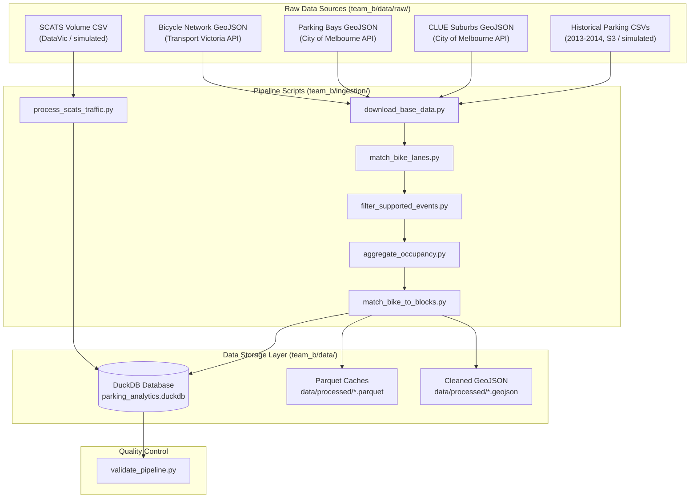

# Data Curation & Transformation Pipeline (Stream B)

This document details the datasets, spatial-temporal constraints, and transformation rules implemented in the Stream B (Traffic Volumes & Parking) ingestion pipeline. 

The pipeline transforms raw spatial layers and massive transactional sensor event logs into a query-optimized DuckDB database supporting the FastAPI and React application.

---

## 1. Pipeline Architecture & Data Flow

The data ingestion process is orchestrated sequentially via [`team_b/run_ingestion.py`](file:///Users/szanevra/repositories/Victoria-Urban-Planning/team_b/run_ingestion.py):

---

## 2. Dataset Inventory

Stream B integrates five primary datasets to evaluate the real-world impacts of bike lane installations on surrounding streetscapes:

1. **Bicycle Infrastructure Network (BIN):** Linear geometries of cycling networks. Heavily filtered to keep active paths and line features.
2. **On-Street Parking Bays:** Point geometries representing individual parking spots. Used to define street capacities.
3. **Small Areas (CLUE Suburbs):** Suburb boundaries within the City of Melbourne municipality. Used to filter and group dashboard metrics.
4. **Historical On-Street Parking Sensor Events:** Timestamped vehicle arrival and departure records (from in-ground sensors) used to compute hourly occupancy rates.
5. **SCATS Traffic Signal Volumes:** Traffic volume counts and saturation metrics at signalized intersections.

---

## 3. Detailed Data Transformations

The pipeline implements several critical spatial, topological, and transactional transformations to resolve anomalies and optimize execution performance.

### A. Spatial Coordinate System Normalization
* **Issue:** Input spatial datasets are in WGS 84 (EPSG:4326) degrees. Planar distance operations (e.g. 20-meter buffers) executed in degrees will yield incorrect results.
* **Resolution:** All spatial layers are dynamically reprojected to the localized GDA2020 / VicGrid system (EPSG:7899, meters) before executing distance joins. Geometries are reprojected back to WGS 84 before saving to disk.

### B. Network Topology Filtering
* **Issue:** The raw Bicycle Network GeoJSON contains virtual routing links (centroid connectors) which create visual artifacts and spikes on the map.
* **Resolution:** connector links are stripped using keyword matching on the description column (keeping segments containing "lane", "path", "segregated", "shared", etc.) and enforcing `LineString` or `MultiLineString` geometry types.

### C. Intersection and Noise Suppression
* **Issue:** Parking bays and sensors located directly at intersections do not map cleanly to linear blocks and introduce double-counting in street-level aggregates.
* **Resolution:** The pipeline drops all parking bays with segment descriptions starting with `Intersection of` or containing invalid descriptors. Additionally, to guarantee data density, street blocks are entirely excluded unless they contain at least **10 parking bays** intersecting the bike lane buffer zone.

### D. Symmetrical Street Name Normalization
* **Issue:** Variations in spelling and abbreviations (e.g. `Little Lonsdale Street` vs `Lt LONSDALE STREET`) prevent table joins between spatial layers and event CSV files.
* **Resolution:** A symmetrical cleaning function is applied in both Python and DuckDB SQL. It upper-cases names, collapses extra whitespaces, and normalizes suffixes (e.g., `LITTLE` $\to$ `LT`, `SAINT` $\to$ `ST`, `STREET` $\to$ `ST`, `ROAD` $\to$ `RD`). Cross streets in block keys are sorted alphabetically to prevent variations based on direction (e.g. `BETWEEN QUEEN AND ELIZABETH` unifies `BETWEEN ELIZABETH AND QUEEN`).

### E. Boundary Suburb Collision Fix
* **Issue:** Border streets separating two suburbs (e.g., Victoria Street, Spring Street) have bays assigned to different suburbs. The raw sensor CSV files arbitrarily tag the street with only one primary suburb, resulting in a 0-bay count mismatch.
* **Resolution:** The pipeline unifies joins strictly on `street_name` and `block_desc`, omitting `suburb` from transactional joins. The suburb mapping is assigned globally from the spatial geometries during finalization.

### F. Dynamic Capacity Engine
* **Issue:** Active parking bays change daily due to sensor malfunctions or construction closures, making static counts unreliable for calculating percentage occupancy rates.
* **Resolution:** Block capacities are computed monthly as the maximum number of distinct active sensors seen broadcasting on that block in a given month. Calculated rates are strictly capped at $1.0$ ($100\%$).

### G. SCATS Traffic Volume Simulation
* **Issue:** SCATS data has access restrictions in sandboxed or offline environments.
* **Resolution:** If `scats_volume_data.csv` is missing from the raw directory, the pipeline automatically generates a structured simulated dataset representing intersection flows (from 2013-01-01 to 2014-12-31 at 15-minute intervals) using a sinusoidal daily-rush profile, loading it into DuckDB.

---

## 4. Ingestion Steps & Execution Sequence

The pipeline contains 7 modular scripts:

1. **[`download_base_data.py`](file:///Users/szanevra/repositories/Victoria-Urban-Planning/team_b/ingestion/download_base_data.py):** Fetches GeoJSON layers from Melbourne Open Data APIs. Falls back to generating simulated parking CSV events in offline/restricted sandbox environments.
2. **[`match_bike_lanes.py`](file:///Users/szanevra/repositories/Victoria-Urban-Planning/team_b/ingestion/match_bike_lanes.py):** Filters networks, performs spatial buffers, joins layers, and outputs matched GeoJSONs.
3. **[`filter_supported_events.py`](file:///Users/szanevra/repositories/Victoria-Urban-Planning/team_b/ingestion/filter_supported_events.py):** Streams large yearly CSVs using DuckDB, matching events against the supported streets list, and outputs optimized Parquet files.
4. **[`process_scats_traffic.py`](file:///Users/szanevra/repositories/Victoria-Urban-Planning/team_b/ingestion/process_scats_traffic.py):** Simulates/imports SCATS intersection traffic logs into DuckDB.
5. **[`aggregate_occupancy.py`](file:///Users/szanevra/repositories/Victoria-Urban-Planning/team_b/ingestion/aggregate_occupancy.py):** Runs hourly window-based minutes calculations and capacity normalization on Parquet files, creating `hourly_occupancy` table.
6. **[`match_bike_to_blocks.py`](file:///Users/szanevra/repositories/Victoria-Urban-Planning/team_b/ingestion/match_bike_to_blocks.py):** Dissolves geometries by block key and populates `block_geometries` and `blocks_summary` tables.
7. **[`validate_pipeline.py`](file:///Users/szanevra/repositories/Victoria-Urban-Planning/team_b/ingestion/validate_pipeline.py):** Checks constraints (e.g. occupancy $\le 1.0$, non-null keys) and generates [`validation_report.md`](file:///Users/szanevra/repositories/Victoria-Urban-Planning/team_b/data/processed/validation_report.md).
