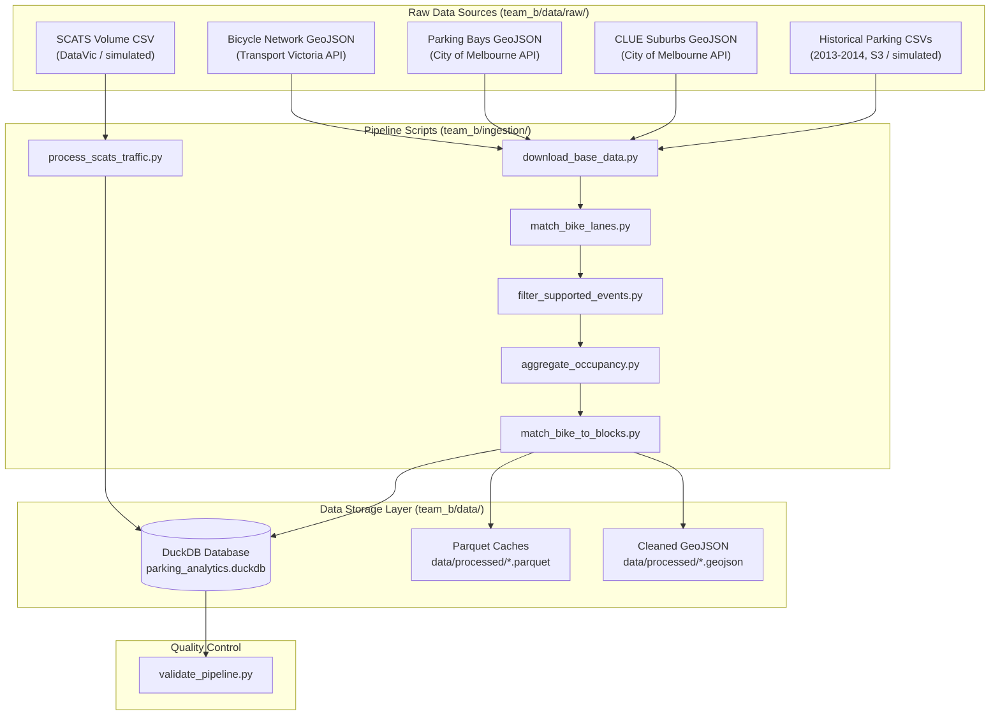

# Team B Data Ingestion & Transformation

This guide explains how we ingest raw geospatial boundaries, bicycle networks, parking bays, and transactional parking sensors, then clean and join them into a centralized DuckDB database for the analytics application.

---

## Pipeline Architecture

The ingestion pipeline is managed by [`team_b/run_ingestion.py`](file:///Users/szanevra/repositories/Victoria-Urban-Planning/team_b/run_ingestion.py). It runs several scripts sequentially to download spatial sources, filter historical sensors, compute occupancy rates, and load the final DuckDB tables.

---

## Source Datasets

We use five primary datasets:

* **Bicycle Infrastructure Network (BIN)**: Linear street geometries defining where cycling infrastructure exists.
* **On-Street Parking Bays**: Coordinates of individual parking spaces used to map bays to blocks and calculate block capacity.
* **CLUE Suburbs**: Boundary geometries used to group and filter metrics by suburb (e.g. Carlton, Melbourne CBD).
* **Historical Parking Sensors**: Arrival and departure event logs from in-ground sensors.
* **SCATS Traffic Volumes**: Historical vehicle throughput volumes at signalized intersections.

---

## Data Cleaning & Transformations

We apply several spatial and string processing steps to clean and join the datasets:

### Coordinate Standardizations
Because the raw spatial layers are provided in WGS 84 degrees (`EPSG:4326`), performing distance calculations (like creating 20-meter buffers around bike lanes) directly in degrees causes inaccuracies. To fix this, the pipeline projects the geometries to the Victorian grid system (`EPSG:7899`, unit: meters), runs the spatial buffering and joins, and then reprojects the coordinates back to WGS 84 for frontend display.

### Topology and Noise Filtering
The raw Bicycle Network dataset contains virtual connectors (routing paths across intersections) which clutter the map and skew segment counts. We strip these out by checking segment descriptions for active infrastructure keywords (e.g., "lane", "path", "segregated") and keeping only valid `LineString` or `MultiLineString` shapes.

Bays located directly at intersections (descriptions starting with `Intersection of`) are dropped since they cannot be associated with a single linear block. Additionally, to avoid sparse or noisy blocks, a street block is only included in the dashboard if it has at least **10 parking bays** within 20 meters of the bicycle lane.

### Name Normalizations & Joins
Spelling discrepancies between spatial records and sensor event logs (e.g. `Little Lonsdale Street` vs `Lt LONSDALE STREET`) prevent direct joins. We normalize all street names in both Python and SQL by converting to uppercase, stripping extra whitespaces, and standardizing common abbreviations (e.g., `LITTLE` $\to$ `LT`, `SAINT` $\to$ `ST`, `STREET` $\to$ `ST`, `ROAD` $\to$ `RD`). Cross streets defining a block (e.g., `between A and B`) are sorted alphabetically to prevent mismatching due to block direction variations.

### Suburb Boundary Corrections
Some border streets (like Victoria Street or Spring Street) have parking bays split between adjacent suburbs. Since the sensor event logs often associate the entire street with only one suburb, joining on suburb names drops valid events. To resolve this, the pipeline performs joins strictly on normalized street names and block descriptions, and then assigns the suburb labels using spatial containment geometries during the final build step.

### Dynamic Month-to-Month Capacity
Because physical sensors frequently go offline or get removed due to road construction, using a static bay count as the block capacity leads to incorrect occupancy calculations (sometimes exceeding 100%). Instead, we dynamically calculate the block capacity for each month by finding the maximum number of distinct sensors that broadcasted an event on that block during that month.

### SCATS Traffic Simulation
To support traffic volume queries when running offline, the pipeline checks for a local `scats_volume_data.csv`. If it is missing, it auto-generates a mock 15-minute interval dataset representing typical traffic flows across target intersections using peak rush hour curves.

---

## Ingestion Scripts

The pipeline is split into these scripts under `team_b/ingestion/`:

* **[`download_base_data.py`](file:///Users/szanevra/repositories/Victoria-Urban-Planning/team_b/ingestion/download_base_data.py)**: Downloads base GeoJSONs. If S3 downloads for historical parking CSVs fail, it auto-generates simulated event files to let the pipeline run locally.
* **[`match_bike_lanes.py`](file:///Users/szanevra/repositories/Victoria-Urban-Planning/team_b/ingestion/match_bike_lanes.py)**: Buffers bike lanes, intersects them with parking bays and suburbs, and outputs the matched geometries.
* **[`filter_supported_events.py`](file:///Users/szanevra/repositories/Victoria-Urban-Planning/team_b/ingestion/filter_supported_events.py)**: Streams the large raw CSV events through DuckDB to extract events matching our supported streets, saving the output as compressed Parquet files.
* **[`process_scats_traffic.py`](file:///Users/szanevra/repositories/Victoria-Urban-Planning/team_b/ingestion/process_scats_traffic.py)**: Imports or simulates SCATS traffic counts into the database.
* **[`aggregate_occupancy.py`](file:///Users/szanevra/repositories/Victoria-Urban-Planning/team_b/ingestion/aggregate_occupancy.py)**: Aggregates the raw events into hourly occupancy percentages using DuckDB window functions.
* **[`match_bike_to_blocks.py`](file:///Users/szanevra/repositories/Victoria-Urban-Planning/team_b/ingestion/match_bike_to_blocks.py)**: Groups bike lanes by block, dissolves linear geometries for map visualization, and creates the blocks summary tables.
* **[`validate_pipeline.py`](file:///Users/szanevra/repositories/Victoria-Urban-Planning/team_b/ingestion/validate_pipeline.py)**: Performs final integrity checks (such as bounds checking on occupancy rates and verifying key constraints) and writes a markdown report.
