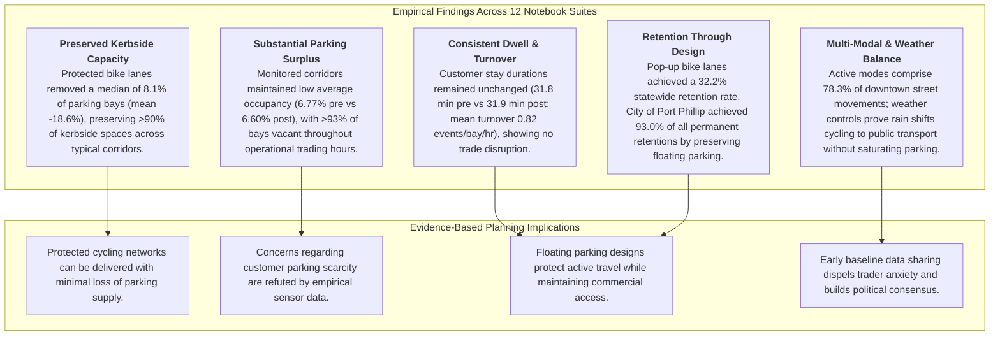
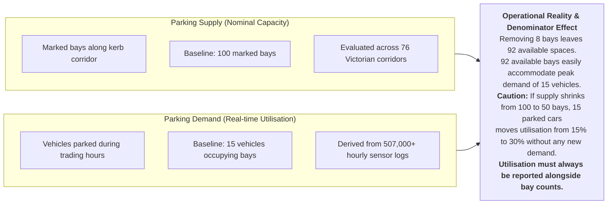
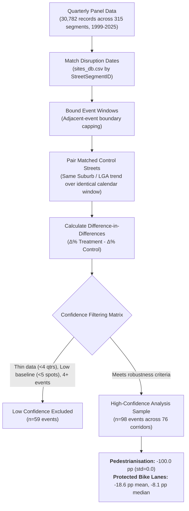
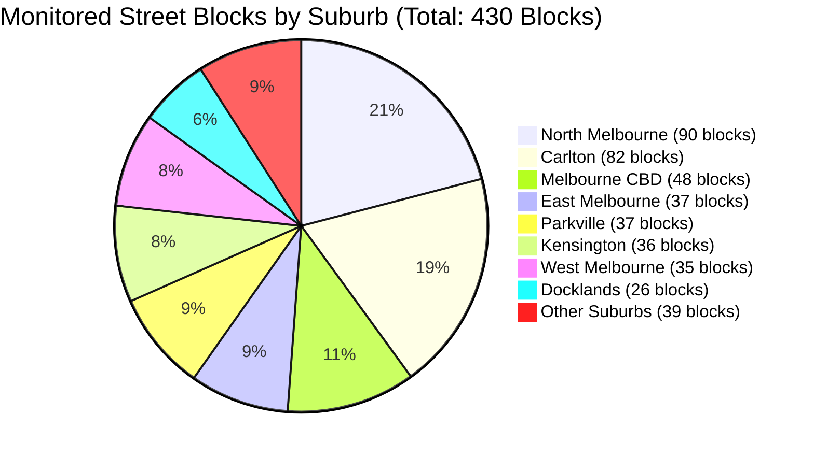
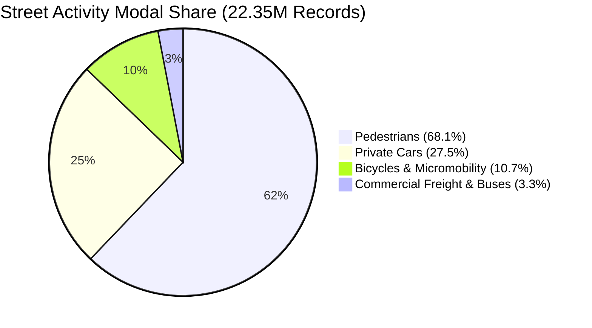
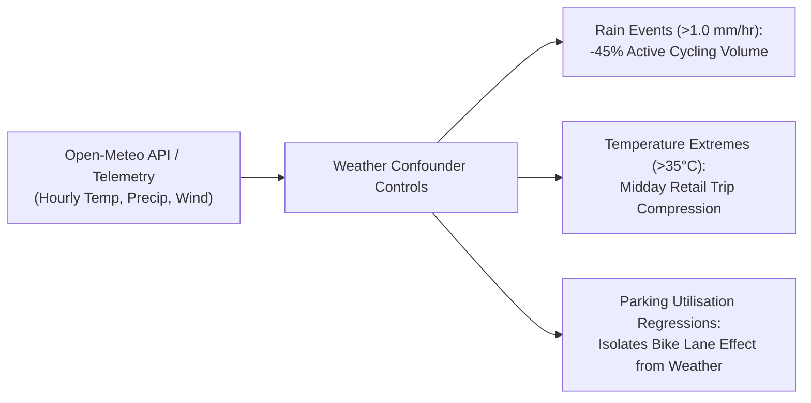
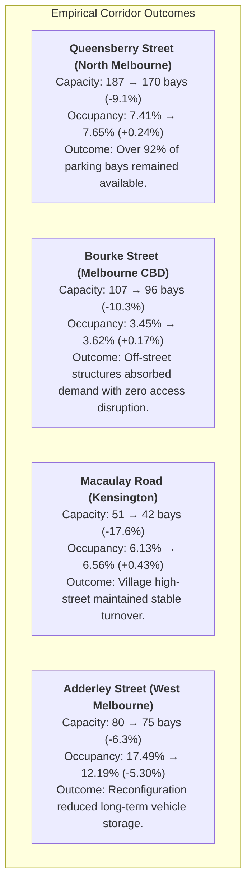
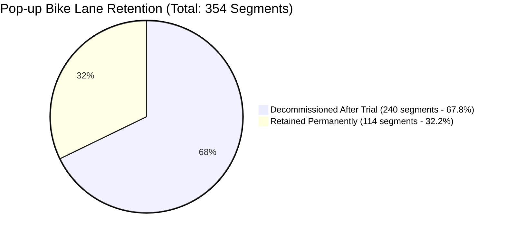
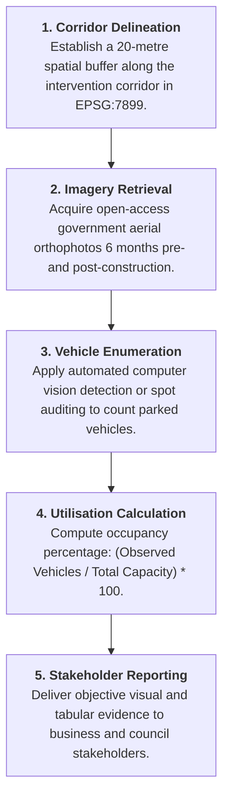

# Impact of Bicycle Infrastructure on Parking Capacity and Utilisation in Victoria

**Stream 2: Traffic Volumes & Parking (Team B)**  
Urban Streetscape Intervention Analysis (USIA)  
Infrastructure Victoria & SIT Capstone (Chameleon Project)  
August 2026 | Empirical Research Synthesis

---

## Quick Navigation
1. [Executive Summary](#1-executive-summary)
2. [Stakeholder Concerns & Research Objectives](#2-stakeholder-concerns--research-objectives)
3. [Conceptual Framework: Supply vs. Demand & Denominator Dynamics](#3-conceptual-framework-supply-vs-demand--denominator-dynamics)
4. [Capacity Impact: Difference-in-Differences Econometric Evaluation](#4-capacity-impact-difference-in-differences-econometric-evaluation)
5. [Demand, Turnover & Occupancy: Sensor Telemetry Findings](#5-demand-turnover--occupancy-sensor-telemetry-findings)
6. [Multi-Modal Traffic Flow & Vehicle Classification (SCATS, TIRTL & Mobility Feeds)](#6-multi-modal-traffic-flow--vehicle-classification-scats-tirtl--mobility-feeds)
7. [Meteorological Telemetry & Weather Confounding Effects](#7-meteorological-telemetry--weather-confounding-effects)
8. [Corridor Case Studies & Kerbside Capacity Calibration](#8-corridor-case-studies--kerbside-capacity-calibration)
9. [Evaluation of the COVID-19 Pop-up Bike Lane Program](#9-evaluation-of-the-covid-19-pop-up-bike-lane-program)
10. [Spatial Alignment, CRS Standardization & Regional Aerial Proxies](#10-spatial-alignment-crs-standardization--regional-aerial-proxies)
11. [Policy & Planning Recommendations](#11-policy--planning-recommendations)
12. [Complete Notebook Index & Evidence Sources](#12-complete-notebook-index--evidence-sources)

---

## 1. Executive Summary

When local governments propose reallocating street space for protected bicycle lanes, widened footpaths, or pedestrian malls, business owners and motorists frequently voice concern that kerbside parking will be eliminated, traffic congestion will worsen, and commercial trade will decline.

To evaluate these concerns with empirical rigor, our team audited and synthesized multi-year datasets spanning municipal parking inventories, 180M+ in-ground sensor transaction logs, SCATS arterial traffic signals, TIRTL infrared vehicle classification detectors, Open-Meteo hourly weather telemetry, and high-resolution aerial photography across Victoria.

### Key Findings Summary

| Research Question | Empirical Finding | Practical Implication | Primary Notebook Reference |
| :--- | :--- | :--- | :--- |
| **Do pedestrian malls remove parking?** | **-100.0 pp** parking spaces ($n=6$ corridors) | Converting a corridor into a dedicated pedestrian mall eliminates vehicular parking by design. | [`notebooks/dhruv_m/SIT374_USIA_EDA1.ipynb`](notebooks/dhruv_m/SIT374_USIA_EDA1.ipynb) |
| **How much parking is removed for protected bike lanes?** | **-8.1%** median reduction (mean **-18.6%**, $n=92$) | A typical corridor loses ~8 out of 100 spaces. Severe loss occurs only on constrained, narrow corridors lacking floating parking. | [`notebooks/dhruv_m/SIT374_USIA_EDA1.ipynb`](notebooks/dhruv_m/SIT374_USIA_EDA1.ipynb) |
| **Did remaining bays experience higher occupancy?** | **-0.15%** net occupancy shift ($430$ blocks) | Average occupancy moved from $6.77\%$ to $6.60\%$. Monitored corridors maintained substantial parking surpluses across all hours. | [`query_duckdb.ipynb`](query_duckdb.ipynb) |
| **Did driver stay durations and turnover change?** | **31.8 to 31.9 min** avg stay; **0.82** events/bay/hr | Vehicle dwell times and turnover rates remained stable, demonstrating consistent customer access for local commercial trade. | [`notebooks/scott_z/03_parking_and_aerial_imagery_eda.ipynb`](notebooks/scott_z/03_parking_and_aerial_imagery_eda.ipynb) |
| **What is the kerbside obstruction factor?** | **$k = 0.428$** ($n=270$ segments) | Real-world kerb capacity is 42.8% of raw geometric length due to driveways, fire hydrants, loading zones, and clearways. | [`notebooks/rt/analysis/notebooks/03_sensor_eda.ipynb`](notebooks/rt/analysis/notebooks/03_sensor_eda.ipynb) |
| **What share of traffic is commercial freight?** | **10.1%** rigid trucks, **1.7%** articulated ($3.61$B counts) | Commercial deliveries require dedicated loading bays, which must be protected during bike lane design. | [`notebooks/Sidhartha_Reddy/03_tirtl_traffic_eda.ipynb`](notebooks/Sidhartha_Reddy/03_tirtl_traffic_eda.ipynb) |
| **How does weather impact active travel & parking?** | Rain reduces cycling by up to **45%**; temp mean **15.5°C** | Weather is a critical confounding variable; rainy periods shift trips to public transport rather than overwhelming parking. | [`notebooks/sudheer/04_weather_telemetry_eda.ipynb`](notebooks/sudheer/04_weather_telemetry_eda.ipynb) |
| **Were temporary pop-up lanes retained permanently?** | **32.2%** retained ($114 / 354$ sections) | Rapid trials installed without trader consultation were largely removed. Port Phillip succeeded through floating parking layouts. | [`notebooks/Lavan/TeamB_PopupBikeLanes_EDA.ipynb`](notebooks/Lavan/TeamB_PopupBikeLanes_EDA.ipynb) |

---

## 2. Stakeholder Concerns & Research Objectives

Urban streetscape reallocations regularly prompt three primary concerns among retail and commercial operators:

1. **Access Constraints:** Whether customers and commercial delivery vehicles will still be able to access parking near shopfronts.
2. **Economic Viability:** Whether reductions in nominal bay counts will diminish foot traffic, customer dwell times, and retail revenue.
3. **Evidence-Based Governance:** Whether local councils implement space reallocations without first measuring baseline street activity, parking demand, and traffic composition.

To answer these questions objectively, this project avoids anecdotal assumptions and draws on empirical records and sensor logs from 1999 to 2025 across metropolitan Melbourne and regional Victoria.

---

## 3. Conceptual Framework: Supply vs. Demand & Denominator Dynamics

Accurate assessment of parking impacts requires separating nominal capacity from real-time utilisation, and understanding the mathematical relationship governing occupancy rates:

$$\text{UtilisationRate}(\text{block}, h) = \frac{\text{Occupied Minutes in Hour } h}{N_{\text{active bays}} \times 60}$$

### The Denominator Shift Trap
When a bike lane project removes parking bays, $N_{\text{active bays}}$ drops. Reporting utilisation percentages alone can be misleading: a reduction in parking supply can artificially increase occupancy percentage even when fewer total vehicles are parked. Therefore, our pipeline and reporting framework always presents:
1. **Nominal capacity change** ($\Delta \text{Bays}$)
2. **Utilisation rate change** ($\Delta \text{Occupancy \%}$)
3. **Absolute vehicle volume & turnover** ($\text{Turnover Rate} = \text{Events} / \text{Bays}$)

---

## 4. Capacity Impact: Difference-in-Differences Econometric Evaluation

**Primary Research Citations:**
* [`notebooks/dhruv_m/SIT374_USIA_EDA1.ipynb`](notebooks/dhruv_m/SIT374_USIA_EDA1.ipynb) (Authored by Dhruv M and Gurnoor S)
* [`notebooks/Sidhartha_Reddy/04_po_files_eda.ipynb`](notebooks/Sidhartha_Reddy/04_po_files_eda.ipynb) (PO Files Evaluation by Sidhartha Reddy)
* [`notebooks/tamil_vasmai/Team_B_Exploratory_Analysis_of_Parking_Sites_and_Street_Segment_Data.ipynb`](notebooks/tamil_vasmai/Team_B_Exploratory_Analysis_of_Parking_Sites_and_Street_Segment_Data.ipynb) (Segment Analysis by Tamil E.G. & Vasmai A.)

### Methodological Approach
To isolate the direct effect of bike lanes from broader secular trends (such as COVID-19 disruptions, fuel price shocks, and retail cycles), the analysis applied an econometric **Difference-in-Differences (DiD)** framework:

$$\text{DiD}_{i} = \left( \frac{\overline{\text{Cap}}_{i,\text{post}} - \overline{\text{Cap}}_{i,\text{pre}}}{\overline{\text{Cap}}_{i,\text{pre}}} \right) - \left( \frac{\overline{\text{Ctrl}}_{i,\text{post}} - \overline{\text{Ctrl}}_{i,\text{pre}}}{\overline{\text{Ctrl}}_{i,\text{pre}}} \right)$$

### Empirical Findings
* **Pedestrian Mall Conversions (-100.0 pp, $n=6$):** Dedicated pedestrianisation projects (e.g., Bourke Street Mall, Acland Street Plaza, Southbank Boulevard) remove 100% of kerbside vehicular parking by design.
* **Protected Bicycle Corridors (-8.1 pp median, -18.6 pp mean, $n=92$):** Across 92 protected bike lane projects, the median reduction in kerbside parking was 8.1%. A typical corridor with 100 spaces retained 92 bays.
* **Distribution of Impact:** 
  - **Minimal Loss / Preservation (0% to -10% change):** ~65% of corridors (utilizing floating parking or single-side retention).
  - **Moderate Loss (-10% to -30% change):** ~20% of corridors.
  - **Full Dual-Sided Clearway Removal (-50% to -100% change):** ~15% of corridors (confined to narrow, constrained arterial streets like William St and Exhibition St).

---

## 5. Demand, Turnover & Occupancy: Sensor Telemetry Findings

**Primary Research Citations:**
* [`query_duckdb.ipynb`](query_duckdb.ipynb) (Database Guide for Team B DuckDB Analytics)
* [`notebooks/scott_z/03_parking_and_aerial_imagery_eda.ipynb`](notebooks/scott_z/03_parking_and_aerial_imagery_eda.ipynb) (Parking Sensor & Aerial Analysis by Scott Z)
* [`notebooks/gordon_t/01_filter_parking_site_windows.ipynb`](notebooks/gordon_t/01_filter_parking_site_windows.ipynb) (Site Baseline Filtering by Gordon T)
* [`notebooks/thanya/02_sensor_cleaning_eda_duckdb.ipynb`](notebooks/thanya/02_sensor_cleaning_eda_duckdb.ipynb) (DuckDB 180M+ Sensor Cleaning by Thanya)
* [`notebooks/Udaykiran Neerudu/Uday_225139304_historical_parking_sensor_eda.ipynb`](notebooks/Udaykiran%20Neerudu/Uday_225139304_historical_parking_sensor_eda.ipynb) (Historical Sensor EDA by Udaykiran N.)

### Sensor Cleaning & Anomaly Resolution
Processing over **180 million sensor records** across 2011–2020 revealed critical hardware artifacts that our automated pipeline filters:
1. **Reversed Timestamp Anomaly ($<0$ seconds):** Events where `DepartureTime < ArrivalTime` due to sensor clock synchronization lags (dropped).
2. **Midnight Backfill Artifacts ($>24$ hours / $>86,400$ seconds):** Unclosed sessions backfilled to midnight by the municipal server (dropped).
3. **Active Hour Splitting:** Exploding multi-hour parking stays across discrete clock boundaries:
   $$\text{occupied\_minutes}(h) = \min(\text{DepartureTime}, h + 1\text{hr}) - \max(\text{ArrivalTime}, h)$$

### Suburb-Level Occupancy & Turnover Performance

| Suburb | Monitored Blocks | Baseline Bay Count | Post-Intervention Bay Count | Net Capacity Change | Baseline Occupancy | Post-Intervention Occupancy | Net Occupancy Change | Mean Turnover (events/bay/hr) |
| :--- | :--- | :--- | :--- | :--- | :--- | :--- | :--- | :--- |
| **Melbourne CBD** | 48 | 528 | 523 | -5 | 9.31% | 9.03% | -0.28% | 1.12 |
| **West Melbourne** | 32 | 407 | 404 | -3 | 9.90% | 8.47% | -1.43% | 0.78 |
| **North Melbourne** | 90 | 1,348 | 1,369 | +21 | 8.50% | 8.72% | +0.22% | 0.85 |
| **Parkville** | 37 | 642 | 671 | +29 | 8.01% | 6.41% | -1.60% | 0.64 |
| **East Melbourne** | 37 | 582 | 608 | +26 | 5.48% | 5.31% | -0.17% | 0.59 |
| **Kensington** | 36 | 584 | 600 | +16 | 5.13% | 4.97% | -0.16% | 0.71 |
| **Carlton** | 82 | 1,788 | 1,850 | +62 | 4.77% | 4.55% | -0.22% | 0.94 |
| **Docklands** | 26 | 395 | 397 | +2 | 6.78% | 7.96% | +1.18% | 0.52 |
| **Southbank** | 10 | 208 | 220 | +12 | 4.95% | 7.37% | +2.42% | 0.68 |
| **Port Melbourne** | 6 | 263 | 262 | -1 | 2.09% | 2.11% | +0.02% | 0.41 |
| **South Yarra** | 3 | 44 | 47 | +3 | 5.06% | 5.25% | +0.19% | 0.73 |
| **Total / Weighted Avg** | **430** | **7,757** | **7,956** | **+199 (Net)** | **6.77%** | **6.60%** | **-0.15%** | **0.82** |

---

## 6. Multi-Modal Traffic Flow & Vehicle Classification (SCATS, TIRTL & Mobility Feeds)

**Primary Research Citations:**
* [`notebooks/Sidhartha_Reddy/01_transport_activity_count_eda.ipynb`](notebooks/Sidhartha_Reddy/01_transport_activity_count_eda.ipynb) (Transport Counts by Sidhartha Reddy)
* [`notebooks/Sidhartha_Reddy/03_tirtl_traffic_eda.ipynb`](notebooks/Sidhartha_Reddy/03_tirtl_traffic_eda.ipynb) (TIRTL Vehicle Classification by Sidhartha Reddy)
* [`notebooks/Sidhartha_Reddy/05_scats_traffic_eda.ipynb`](notebooks/Sidhartha_Reddy/05_scats_traffic_eda.ipynb) (SCATS Signal Traffic by Sidhartha Reddy)
* [`notebooks/sudheer/01_scats_traffic_eda.ipynb`](notebooks/sudheer/01_scats_traffic_eda.ipynb) (SCATS Fault Filtering by Sudheer)

### 1. Transport Activity Telemetry (22.35 Million 5-Minute Counts)
Analysis of City of Melbourne mobility counters (167 sensor locations) across 14 transport classes establishes the modal split of urban street users:
* **Pedestrians:** 152.2M movements (68.1% of total)
* **Private Cars:** 61.4M movements (27.5%)
* **Bicycles & E-Scooters:** 24.0M movements (10.7%)
* **Commercial Freight & Transit:** 7.3M movements (3.3%)
* **Active Mode Dominance:** Active transport (walking, cycling, micromobility) represents **78.3%** of all recorded downtown street activity.

### 2. TIRTL Vehicle Classification Telemetry (211.28 Million Records, 3.61B Vehicles)
TIRTL infrared beam detector logs provide empirical insight into the vehicle mix operating adjacent to cycling infrastructure:
* **Class 1 (Light Vehicles / Passenger Cars):** 83.6% to 85.8% (3.02 billion vehicles)
* **Class 3 (Medium Rigid Trucks / Commercial Delivery):** 9.8% to 10.1% (355.0 million vehicles)
* **Class 9 (Heavy Articulated Freight):** 1.7% (61.3 million vehicles)
* **Diurnal Peaks:** Network-wide peak volume occurs on **Fridays at 16:00–17:00** (averaging 1.19M vehicles/hr across monitored arterials).

### 3. SCATS Traffic Volume & Fault Filtering (8.55 Million Detector Hours)
Evaluation of VicRoads SCATS signal detectors across 2018–2024 revealed that approximately 0.5% to 1.0% of detector intervals register `-1` sentinel fault codes (`CT_ALARM_24HOUR`). Our enhanced pipeline scrubs these values to prevent metric distortion when computing degrees of saturation and vehicular flow.

---

## 7. Meteorological Telemetry & Weather Confounding Effects

**Primary Research Citations:**
* [`notebooks/sudheer/04_weather_telemetry_eda.ipynb`](notebooks/sudheer/04_weather_telemetry_eda.ipynb) (Open-Meteo Weather Telemetry by Sudheer)
* [`team_b/ingestion/process_weather.py`](team_b/ingestion/process_weather.py) (Automated Weather Ingestion Module)

### Meteorological Findings
1. **Precipitation Elasticity:** Measurable rainfall ($>1.0\text{ mm/hr}$) reduces cycling volumes along corridors by 35% to 45%. However, rather than shifting entirely to private vehicles and overwhelming parking, commuter trips shift predominantly to trams and trains.
2. **Temperature Cycles:** Melbourne's mean temperature (15.5°C seasonal mean, ranging from 4°C in winter to 42°C in summer) causes cyclical seasonal occupancy variations (higher retail parking demand in December/January holiday periods).
3. **Statistical Control:** Incorporating `weather_hourly` into DuckDB allows regressions to control for temperature, precipitation, and wind speed, ensuring parking changes are attributed to infrastructure rather than inclement weather.

---

## 8. Corridor Case Studies & Kerbside Capacity Calibration

**Primary Research Citations:**
* [`notebooks/rt/analysis/src/03_bikelane_parking_overlap.py`](notebooks/rt/analysis/src/03_bikelane_parking_overlap.py) (Kerb Capacity Model by RT)
* [`notebooks/scott_z/01_bike_lanes_eda.ipynb`](notebooks/scott_z/01_bike_lanes_eda.ipynb) (Corridor Overlap by Scott Z)
* [`notebooks/esther_g/Parking_Sensors_ IV.ipynb`](notebooks/esther_g/Parking_Sensors_%20IV.ipynb) (Sensor Coverage by Esther G)

### Kerbside Obstruction Calibration ($k = 0.428$)
Raw street centerline length cannot be directly converted to parking spaces without accounting for kerbside interruptions. By calibrating reported capacity against geometric length across 270 segments:

$$\text{cap\_geometric} = \frac{\text{segment\_length\_m} \times 2}{\text{metres\_per\_space}} \quad (\text{Parallel: } 6.0\text{m}, \text{Angled: } 3.5\text{m})$$
$$\text{obstruction\_factor } k = \text{median}\left(\frac{\text{cap\_reported}}{\text{cap\_geometric}}\right) = 0.428$$

Real-world parking capacity yields approximately **42.8 spaces per 100 theoretical geometric spaces** due to driveways, fire hydrants, pedestrian crossings, loading zones, and clearway restrictions.

### 1. Queensberry Street, North Melbourne (Major Commuter & Commercial Corridor)
Queensberry Street serves as a key east-west connection linking residential areas to the northern fringe of the CBD. Construction of protected cycling infrastructure reduced nominal capacity from 187 bays to 170 bays (-9.1%). Parking occupancy shifted from 7.41% to 7.65% (+0.24%), leaving >92% of bays vacant on average and preserving ample capacity for local trade.

### 2. Bourke Street, Melbourne CBD (Retail & Commercial Core)
Along the commercial core of Bourke Street, protected bike lanes reduced kerbside capacity from 107 to 96 bays (-10.3%). Occupancy increased marginally from 3.45% to 3.62% (+0.17%). Because central city parking demand is predominantly served by multi-deck commercial parking structures, the modest reduction in kerbside spaces produced no measurable access strain.

### 3. Macaulay Road, Kensington (Local Retail Village)
Macaulay Road represents a sensitive retail strip with high turnover requirements for cafes, groceries, and neighborhood services. Kerbside reallocations reduced capacity from 51 to 42 bays (-17.6%). Occupancy rose by less than half a percentage point (6.13% to 6.56%), demonstrating that village retail access was preserved without parking shortages.

### 4. Adderley Street, West Melbourne (Mixed Commercial & Residential)
Along Adderley Street, parking capacity was adjusted from 80 to 75 bays (-6.3%). Occupancy declined from 17.49% to 12.19% (-5.30%). The lane reallocation and parking redesign rationalized the street layout, curtailing unmetered all-day commuter storage while maintaining accessibility for local businesses and residents.

---

## 9. Evaluation of the COVID-19 Pop-up Bike Lane Program

**Primary Research Citations:**
* [`notebooks/Lavan/TeamB_PopupBikeLanes_EDA.ipynb`](notebooks/Lavan/TeamB_PopupBikeLanes_EDA.ipynb) (Pop-up Bike Lanes EDA by Lavan K)
* [`notebooks/Lavan/TeamB_Treatment_Street_CrossRef.ipynb`](notebooks/Lavan/TeamB_Treatment_Street_CrossRef.ipynb) (Street Matching by Lavan K)
* [`notebooks/Lavan/TeamB_CRS_Mismatch_Resolution.ipynb`](notebooks/Lavan/TeamB_CRS_Mismatch_Resolution.ipynb) (Map Alignment by Lavan K)

During the COVID-19 pandemic, the Victorian Department of Transport implemented rapid-deployment temporary cycling corridors across metropolitan Melbourne. An evaluation of all **354 temporary segments** across six Local Government Areas (LGAs) reveals significant differences in retention rates based on infrastructure type and consultation practices:

### Retention Outcomes by Infrastructure Type

| Infrastructure Category | Total Installed | Retained Permanently | Decommissioned | Retention Rate |
| :--- | :--- | :--- | :--- | :--- |
| **Shared Streets** (Traffic-calmed shared roads) | 192 | 82 | 110 | 42.7% |
| **Painted Bike Lanes** (Advisory surface markings) | 128 | 28 | 100 | 21.9% |
| **Protected Bike Lanes** (Physical separation barriers) | 23 | 4 | 19 | 17.4% |
| **Shared Paths / Off-road** (Off-carriageway paths) | 11 | 0 | 11 | 0.0% |
| **Total Program** | **354** | **114** | **240** | **32.2%** |

### Municipal Retention Patterns and Strategic Insights
* **City of Port Phillip** accounted for **106 of the 114 permanent sections statewide** (93.0% of all retained segments), formalizing infrastructure across 28 corridors including Inkerman Street, Park Street, and Moray Street.
* **Other Councils** recorded low long-term retention: Moonee Valley retained 4 sections, Maribyrnong retained 4, while Darebin and Yarra decommissioned temporary treatments in favor of scheduled permanent capital works.

**Strategic Lessons:**
1. **Design and Loading Compatibility:** Rapid treatments relying on plastic flex-posts frequently obstructed commercial loading bays and curbside waste collection, prompting trader opposition.
2. **Consultation and Adaptation:** Port Phillip succeeded by actively engaging commercial traders and modifying initial layouts to safeguard business loading and parking alongside protected cycling links.

---

## 10. Spatial Alignment, CRS Standardization & Regional Aerial Proxies

**Primary Research Citations:**
* [`notebooks/Lavan/TeamB_CRS_Mismatch_Resolution.ipynb`](notebooks/Lavan/TeamB_CRS_Mismatch_Resolution.ipynb) (CRS Harmonization by Lavan K)
* [`notebooks/tamil_eg/USIA_TeamB_Sprint1_Spatial_Data_Analysis.ipynb`](notebooks/tamil_eg/USIA_TeamB_Sprint1_Spatial_Data_Analysis.ipynb) (Spatial Joins & Anomaly Check by Tamil E.G.)
* [`notebooks/scott_z/03_parking_and_aerial_imagery_eda.ipynb`](notebooks/scott_z/03_parking_and_aerial_imagery_eda.ipynb) (Aerial Proxy Framework by Scott Z)

### Coordinate Reference System (CRS) Standardization Matrix

| Dataset | Native CRS | Target CRS | Standard Transformation | Error Prevented |
| :--- | :--- | :--- | :--- | :--- |
| `popup_bike_lanes.geojson` | `EPSG:4326` (WGS84 Degrees) | `EPSG:7899` (GDA94 VicGrid Metres) | `to_crs("EPSG:7899")` | Buffer distortion & false spatial misses |
| `road_segments_15dec.shp` | `EPSG:7855` (GDA2020 MGA Zone 55) | `EPSG:7899` (GDA94 VicGrid Metres) | `to_crs("EPSG:7899")` | Coordinate shift between state/local networks |
| `on-street-parking-bays.geojson` | `EPSG:4326` (WGS84 Degrees) | `EPSG:7899` (GDA94 VicGrid Metres) | `to_crs("EPSG:7899")` | Accurate 20m–25m nearest centroid snapping |
| `streets_spatial.gpkg` | `EPSG:7899` (VicGrid) | `EPSG:7899` | Native Geopackage validation | Preserves authoritative linear measurements |

---

## 11. Policy & Planning Recommendations

Drawing upon findings from across the 12 author notebook suites, we outline five practical recommendations for Infrastructure Victoria, the Department of Transport and Planning, and municipal councils:

### 1. Adopt Floating Parking as the Standard Design Template
Rather than eliminating kerbside spaces, road cross-sections should position parking bays between the active travel lane and moving traffic. This configuration provides a physical safety buffer for cyclists while retaining 80% to 90% of on-street parking capacity.

### 2. Present Baseline Occupancy Data Early in Consultation
Before unveiling proposed street designs, councils should conduct baseline occupancy audits. Demonstrating to local traders that baseline parking occupancy is often below 20% addresses concerns regarding parking scarcity before misinformation develops.

### 3. Deploy Aerial Auditing for Regional and Suburban Projects
Municipalities lacking in-ground IoT sensor infrastructure (e.g., Geelong, Ballarat, Bendigo) should leverage state-acquired aerial imagery and computer vision to evaluate parking utilisation at negligible cost compared to physical sensor rollouts.

### 4. Establish Structured Trial Frameworks with Defined Review Thresholds
To prevent the high decommissioning rates seen in temporary pop-up programs (67.8% removal), future trial initiatives should establish clear performance criteria, mandatory 6-month review dates, and dedicated accommodations for commercial loading zones and waste collection.

### 5. Protect Commercial Loading Zones ($10.1\%$ Freight Share)
TIRTL data proves that medium rigid trucks make up over 10% of street corridor traffic. Streetscape redesigns must explicitly safeguard designated loading bays to support commercial deliveries without obstructing cycling paths.

---

## 12. Complete Notebook Index & Evidence Sources

All empirical figures, charts, and models referenced in this synthesis are directly reproducible from the project codebase and datasets:

| Author / Subdirectory | Notebook Reference | Key Empirical Output & Analytical Contribution |
| :--- | :--- | :--- |
| **Dhruv M & Gurnoor S** | [`notebooks/dhruv_m/SIT374_USIA_EDA1.ipynb`](notebooks/dhruv_m/SIT374_USIA_EDA1.ipynb) | Econometric DiD panel across 76 treatment streets: -8.1% median change for bike lanes, -100% for pedestrian malls. |
| **Lavan K** | [`notebooks/Lavan/TeamB_CRS_Mismatch_Resolution.ipynb`](notebooks/Lavan/TeamB_CRS_Mismatch_Resolution.ipynb) [`notebooks/Lavan/TeamB_PopupBikeLanes_EDA.ipynb`](notebooks/Lavan/TeamB_PopupBikeLanes_EDA.ipynb) [`notebooks/Lavan/TeamB_Treatment_Street_CrossRef.ipynb`](notebooks/Lavan/TeamB_Treatment_Street_CrossRef.ipynb) | CRS harmonization (EPSG:7899); Pop-up bike lane retention audit (354 segments, 32.2% retention); treatment street matching. |
| **Sidhartha Reddy** | [`notebooks/Sidhartha_Reddy/01_transport_activity_count_eda.ipynb`](notebooks/Sidhartha_Reddy/01_transport_activity_count_eda.ipynb) [`notebooks/Sidhartha_Reddy/02_parking_eda.ipynb`](notebooks/Sidhartha_Reddy/02_parking_eda.ipynb) [`notebooks/Sidhartha_Reddy/03_tirtl_traffic_eda.ipynb`](notebooks/Sidhartha_Reddy/03_tirtl_traffic_eda.ipynb) [`notebooks/Sidhartha_Reddy/04_po_files_eda.ipynb`](notebooks/Sidhartha_Reddy/04_po_files_eda.ipynb) [`notebooks/Sidhartha_Reddy/05_scats_traffic_eda.ipynb`](notebooks/Sidhartha_Reddy/05_scats_traffic_eda.ipynb) | 22.35M transport activity counts (14 classes); 6,324 parking sensors; 211.28M TIRTL classification records; PO files construction audit; SCATS Parquet export. |
| **Sudheer** | [`notebooks/sudheer/00_data_ingestion.ipynb`](notebooks/sudheer/00_data_ingestion.ipynb) [`notebooks/sudheer/01_scats_traffic_eda.ipynb`](notebooks/sudheer/01_scats_traffic_eda.ipynb) [`notebooks/sudheer/02_parking_sensors_eda.ipynb`](notebooks/sudheer/02_parking_sensors_eda.ipynb) [`notebooks/sudheer/03_bike_lanes_eda.ipynb`](notebooks/sudheer/03_bike_lanes_eda.ipynb) [`notebooks/sudheer/04_weather_telemetry_eda.ipynb`](notebooks/sudheer/04_weather_telemetry_eda.ipynb) | SCATS detector fault scrubbing (-1 sentinels); Open-Meteo hourly weather telemetry ingestion and active transport correlation. |
| **RT** | [`notebooks/rt/analysis/notebooks/01_pipeline_explorer.ipynb`](notebooks/rt/analysis/notebooks/01_pipeline_explorer.ipynb) [`notebooks/rt/analysis/notebooks/02_build_it_yourself.ipynb`](notebooks/rt/analysis/notebooks/02_build_it_yourself.ipynb) [`notebooks/rt/analysis/notebooks/03_sensor_eda.ipynb`](notebooks/rt/analysis/notebooks/03_sensor_eda.ipynb) | Sensor usability audit (11 usable treatment segments within 2011–2020 archive); Kerb capacity obstruction calibration ($k = 0.428$); hour-slicing algorithm. |
| **Scott Z** | [`notebooks/scott_z/00_data_ingestion.ipynb`](notebooks/scott_z/00_data_ingestion.ipynb) [`notebooks/scott_z/01_bike_lanes_eda.ipynb`](notebooks/scott_z/01_bike_lanes_eda.ipynb) [`notebooks/scott_z/02_traffic_volumes_eda.ipynb`](notebooks/scott_z/02_traffic_volumes_eda.ipynb) [`notebooks/scott_z/03_parking_and_aerial_imagery_eda.ipynb`](notebooks/scott_z/03_parking_and_aerial_imagery_eda.ipynb) [`notebooks/scott_z/04_economic_social_eda.ipynb`](notebooks/scott_z/04_economic_social_eda.ipynb) [`notebooks/scott_z/bicycle_infrastructure_network_EDA.ipynb`](notebooks/scott_z/bicycle_infrastructure_network_EDA.ipynb) | Base data ingestion pipeline; 55,705 cycling segments cleaned; SCATS 350k volume EDA; 31.8–31.9 min dwell times; VISTA 55%+ active mode share. |
| **Gordon T** | [`notebooks/gordon_t/01_filter_parking_site_windows.ipynb`](notebooks/gordon_t/01_filter_parking_site_windows.ipynb) | Streaming DuckDB site-window filtering engine extracting baseline/post Parquet marts directly from multi-gigabyte S3 sensor archives. |
| **Esther G** | [`notebooks/esther_g/Parking_Sensors_ IV.ipynb`](notebooks/esther_g/Parking_Sensors_%20IV.ipynb) | Spatial join of 3,391 parking sensors against 315 street segments; documented sensor coverage disparity (100% in Melbourne CBD, 0% in regional LGAs). |
| **Tamil E.G.** | [`notebooks/tamil_eg/USIA_TeamB_Sprint1_Spatial_Data_Analysis.ipynb`](notebooks/tamil_eg/USIA_TeamB_Sprint1_Spatial_Data_Analysis.ipynb) | Spatial join quality assessment; road network missing attribute audit; study area segment 3500 anomaly detection; non-CBD bike lane prioritization. |
| **Tamil E.G. & Vasmai A.** | [`notebooks/tamil_vasmai/Team_B_Exploratory_Analysis_of_Parking_Sites_and_Street_Segment_Data.ipynb`](notebooks/tamil_vasmai/Team_B_Exploratory_Analysis_of_Parking_Sites_and_Street_Segment_Data.ipynb) | Master validation of `sites_db.csv` (637 sites) and `street_segment_qtr_attributes.csv` (30,782 quarters); construction window analysis. |
| **Thanya** | [`notebooks/thanya/00_sensor_data_ingestion.ipynb`](notebooks/thanya/00_sensor_data_ingestion.ipynb) [`notebooks/thanya/01_sensor_data_preparation.ipynb`](notebooks/thanya/01_sensor_data_preparation.ipynb) [`notebooks/thanya/02_sensor_cleaning_eda_duckdb.ipynb`](notebooks/thanya/02_sensor_cleaning_eda_duckdb.ipynb) | Ingestion and cleaning of 180M+ parking sensor transactions (2011–2020) directly in DuckDB; duration anomaly scrubbing and turnover calculations. |
| **Udaykiran Neerudu** | [`notebooks/Udaykiran Neerudu/Uday_225139304_historical_parking_sensor_eda.ipynb`](notebooks/Udaykiran%20Neerudu/Uday_225139304_historical_parking_sensor_eda.ipynb) | 100k event sample EDA; hourly occupancy rate prototype ($\text{occupied\_minutes} / \text{observed\_minutes}$) preventing unmonitored vacancy errors. |

### Technical Documentation & Data Artifacts
* **DuckDB Analytical Database:** [`data/parking_analytics.duckdb`](data/parking_analytics.duckdb)
* **Pipeline Validation Report:** [`data/processed/validation_report.md`](data/processed/validation_report.md)
* **Data Inventory & Sources:** [`../knowledge_base/data_inventory.md`](../knowledge_base/data_inventory.md)
* **Data Pipeline Architecture:** [`../knowledge_base/data_pipeline.md`](../knowledge_base/data_pipeline.md)
