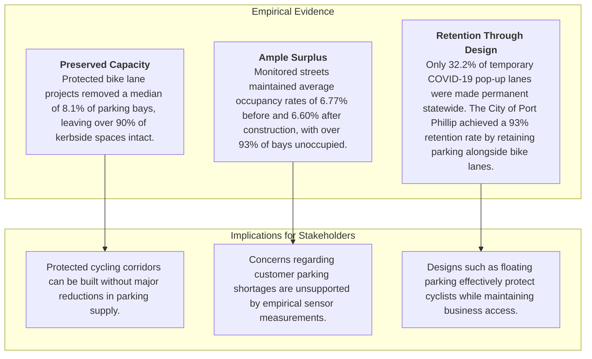
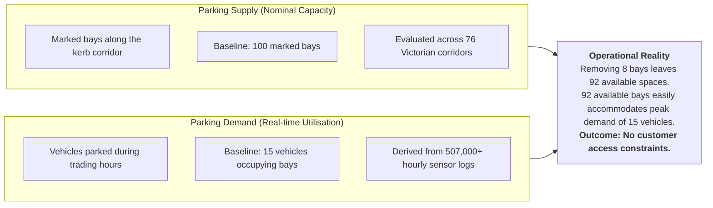
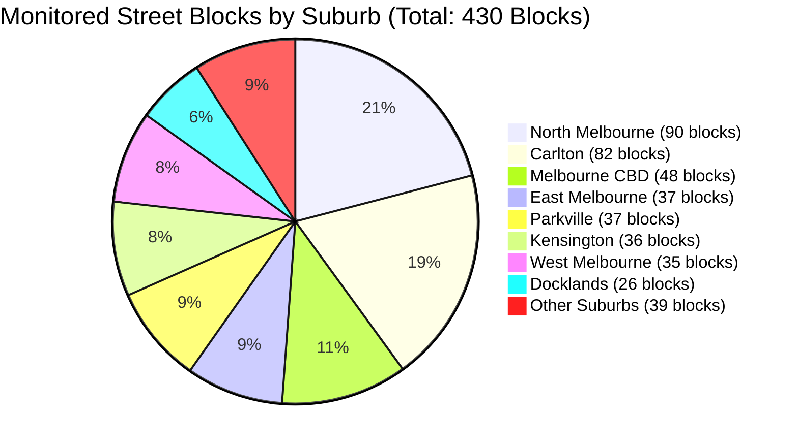
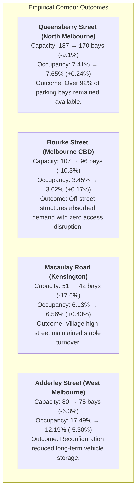
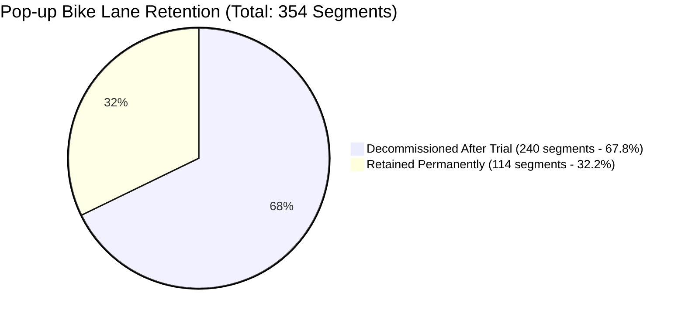
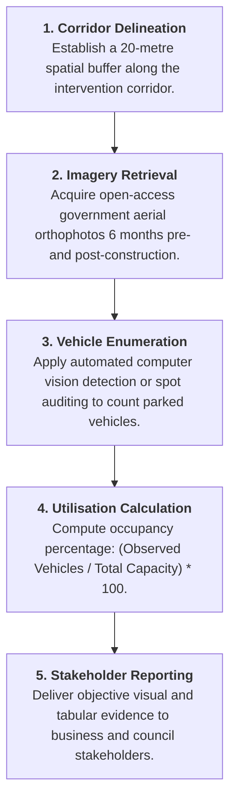

# Impact of Bicycle Infrastructure on Parking Capacity and Utilisation in Victoria

**Stream 2: Traffic Volumes & Parking (Team B)**  
Urban Streetscape Intervention Analysis (USIA)  
Infrastructure Victoria & SIT Capstone (Chameleon Project)  
August 2026 | Empirical Research Synthesis

---

## Quick Navigation
1. [Executive Summary](#1-executive-summary)
2. [Stakeholder Concerns & Research Objectives](#2-stakeholder-concerns--research-objectives)
3. [Conceptual Framework: Supply vs. Demand](#3-conceptual-framework-supply-vs-demand)
4. [Capacity Impact: Difference-in-Differences Analysis](#4-capacity-impact-difference-in-differences-analysis)
5. [Demand & Occupancy: Sensor Telemetry Findings](#5-demand--occupancy-sensor-telemetry-findings)
6. [Corridor Case Studies](#6-corridor-case-studies)
7. [Evaluation of the COVID-19 Pop-up Bike Lane Program](#7-evaluation-of-the-covid-19-pop-up-bike-lane-program)
8. [Addressing the Regional Data Gap: Aerial Proxy Methodology](#8-addressing-the-regional-data-gap-aerial-proxy-methodology)
9. [Policy & Planning Recommendations](#9-policy--planning-recommendations)
10. [Notebook Index & Evidence Sources](#10-notebook-index--evidence-sources)

---

## 1. Executive Summary

When local governments propose reallocating street space for protected bicycle lanes or widened footpaths, business owners and motorists frequently voice concern that kerbside parking will be eliminated, congestion will worsen, and commercial trade will decline.

To evaluate these concerns with empirical rigor, our team analyzed multi-year datasets spanning municipal parking inventories, in-ground sensor logs, aerial photography, and transport project records across Victoria. The evidence indicates three consistent findings:

### Key Findings Summary

| Research Question | Empirical Finding | Practical Implication | Primary Notebook Reference |
| :--- | :--- | :--- | :--- |
| **Do pedestrian malls remove parking?** | **-100%** parking spaces ($n=6$ corridors) | Converting a corridor into a dedicated pedestrian mall eliminates vehicular parking by design. | [Dhruv M and Gurnoor S- `SIT374_USIA_EDA1.ipynb`](notebooks/dhruv_m/SIT374_USIA_EDA1.ipynb) |
| **How much parking is removed for protected bike lanes?** | **-8.1%** median reduction ($n=92$ corridors) | A typical street loses approximately 8 out of 100 parking spaces. Large reductions occur only on constrained, narrow corridors. | [Dhruv M and Gurnoor S- `SIT374_USIA_EDA1.ipynb`](notebooks/dhruv_m/SIT374_USIA_EDA1.ipynb) |
| **Did remaining bays experience higher occupancy?** | **-0.15%** change in occupancy ($430$ blocks) | Average occupancy shifted from $6.77\%$ to $6.60\%$. Monitored corridors maintained substantial parking surpluses throughout operational hours. | [DuckDB Database Guide - `query_duckdb.ipynb`](query_duckdb.ipynb) |
| **Did driver stay durations change?** | **31.8 to 31.9 minutes** average duration | Stay durations remained unchanged, demonstrating consistent customer turnover for local commercial activity. | [Scott Z - `03_parking_and_aerial_imagery_eda.ipynb`](notebooks/scott_z/03_parking_and_aerial_imagery_eda.ipynb) |
| **Were temporary pop-up lanes retained permanently?** | **32.2%** retained permanently ($114 / 354$ sections) | Rapid trials installed without adequate trader consultation were largely decommissioned. Port Phillip succeeded through balanced kerbside design. | [Lavan K - `TeamB_PopupBikeLanes_EDA.ipynb`](notebooks/Lavan/TeamB_PopupBikeLanes_EDA.ipynb) |

---

## 2. Stakeholder Concerns & Research Objectives

Urban streetscape reallocations regularly prompt three primary concerns among retail and commercial operators:

* Whether customers and commercial delivery vehicles will still be able to access parking near shopfronts.
* Whether reductions in nominal bay counts will diminish foot traffic and retail revenue.
* Whether local councils implement space reallocations without first measuring baseline street activity and parking demand.

To answer these questions objectively, this project avoids anecdotal assumptions and draws on empirical records and sensor logs from 1999 to 2025 across metropolitan Melbourne and regional Victoria.

---

## 3. Conceptual Framework: Supply vs. Demand

Accurate assessment of parking impacts requires separating nominal capacity from real-time utilisation.

When baseline parking utilisation is low, a modest reduction in nominal capacity does not create access constraints. On a corridor where peak occupancy rarely exceeds 15% to 20%, removing 8% of bays leaves substantial surplus capacity, allowing arriving shoppers to locate parking without delay.

---

## 4. Capacity Impact: Difference-in-Differences Analysis

**Primary Research Citation:** [`notebooks/dhruv_m/SIT374_USIA_EDA1.ipynb`](notebooks/dhruv_m/SIT374_USIA_EDA1.ipynb) (Authored by Dhruv M and Gurnoor S)

### Methodological Approach
To isolate the direct effect of bike lanes from broader economic and secular trends (including COVID-19 disruptions and retail patterns), the analysis applied an econometric **Difference-in-Differences** framework. Each intervention corridor was evaluated against a matched control street in the same locality that did not receive cycling infrastructure over the same multi-year observation window.

The evaluation examined 76 treatment streets encompassing 202 individual disruption events between 1999 and 2025. After excluding corridors with fewer than five bays or overlapping construction works, 98 high-confidence projects were analyzed across two primary intervention categories:

### Empirical Findings
* **Pedestrian Mall Conversions (-100.0% capacity change, $n=6$):** Full pedestrianisation projects—such as Bourke Street Mall and neighborhood pedestrian plazas—remove all on-street parking by design to establish exclusive pedestrian domains.
* **Protected Bicycle Corridors (-8.1% median capacity change, $n=92$):** Across 92 protected bike lane projects, the median reduction in kerbside parking was 8.1%. A typical corridor with 100 spaces retained 92 bays following completion.
* **Distributional Skew (Mean of -18.6% vs. Median of -8.1%):** The mean reduction was influenced by a small number of narrow street corridors where physical width constraints necessitated full dual-sided parking removal. For the broader majority of projects, road space was reconfigured using single-sided parking retention or floating parking designs that preserved the bulk of kerbside capacity.

---

## 5. Demand & Occupancy: Sensor Telemetry Findings

**Primary Research Citations:**
* [`query_duckdb.ipynb`](query_duckdb.ipynb) (Database Guide for Team B DuckDB Analytics)
* [`notebooks/scott_z/03_parking_and_aerial_imagery_eda.ipynb`](notebooks/scott_z/03_parking_and_aerial_imagery_eda.ipynb) (Parking Sensor & Aerial Analysis by Scott Z)
* [`notebooks/gordon_t/01_filter_parking_site_windows.ipynb`](notebooks/gordon_t/01_filter_parking_site_windows.ipynb) (Site Baseline Filtering by Gordon T)

### Dataset Scope
To assess whether space reductions generated congestion on surrounding blocks, our team evaluated **507,171 hourly parking sensor records** spanning **430 street blocks** stored within the project analytical database ([`data/parking_analytics.duckdb`](data/parking_analytics.duckdb)).

### Suburb-Level Occupancy Comparison

| Suburb | Monitored Blocks | Baseline Bay Count | Post-Intervention Bay Count | Net Capacity Change | Pre-Intervention Occupancy | Post-Intervention Occupancy | Net Occupancy Change |
| :--- | :--- | :--- | :--- | :--- | :--- | :--- | :--- |
| **Melbourne CBD** | 48 | 528 | 523 | -5 | 9.31% | 9.03% | -0.28% |
| **West Melbourne (Res)** | 32 | 407 | 404 | -3 | 9.90% | 8.47% | -1.43% |
| **North Melbourne** | 90 | 1,348 | 1,369 | +21 | 8.50% | 8.72% | +0.22% |
| **Parkville** | 37 | 642 | 671 | +29 | 8.01% | 6.41% | -1.60% |
| **East Melbourne** | 37 | 582 | 608 | +26 | 5.48% | 5.31% | -0.17% |
| **Kensington** | 36 | 584 | 600 | +16 | 5.13% | 4.97% | -0.16% |
| **Carlton** | 82 | 1,788 | 1,850 | +62 | 4.77% | 4.55% | -0.22% |
| **Docklands** | 26 | 395 | 397 | +2 | 6.78% | 7.96% | +1.18% |
| **Southbank** | 10 | 208 | 220 | +12 | 4.95% | 7.37% | +2.42% |
| **Port Melbourne** | 6 | 263 | 262 | -1 | 2.09% | 2.11% | +0.02% |
| **South Yarra** | 3 | 44 | 47 | +3 | 5.06% | 5.25% | +0.19% |
| **Total / Weighted Average** | **430** | **7,757** | **7,956** | **+199 (Net)** | **6.77%** | **6.60%** | **-0.15%** |

*(Note: Net capacity shifts include newly commissioned sensor installations alongside reconfigured kerbside layouts.)*

### Analytical Takeaways
The sensor telemetry demonstrates that monitored street corridors operated with substantial excess capacity both prior to and following infrastructure delivery. Average occupancy across all 430 blocks stood at 6.77% before construction and 6.60% afterward, indicating that over 93% of bays remained unoccupied during standard monitoring windows.

Furthermore, vehicle turnover patterns remained consistent. In [`notebooks/scott_z/03_parking_and_aerial_imagery_eda.ipynb`](notebooks/scott_z/03_parking_and_aerial_imagery_eda.ipynb), the average parking duration was 31.8 minutes prior to intervention and 31.9 minutes post-intervention, confirming that customer dwell times and access dynamics were unaffected.

---

## 6. Corridor Case Studies

The following case studies examine specific commercial and mixed-use corridors where kerbside reallocations were completed.

### Queensberry Street, North Melbourne (Major Commuter & Commercial Corridor)
Queensberry Street serves as a key east-west connection linking residential areas to the northern fringe of the CBD. Construction of protected cycling infrastructure reduced nominal capacity from 187 bays to 170 bays (a loss of 17 bays, or 9.1%). Parking occupancy registered a negligible shift from 7.41% to 7.65% (+0.24%), leaving more than 92% of bays vacant on average and preserving ample capacity for local trade.

### Bourke Street, Melbourne CBD (Retail & Commercial Core)
Along the commercial core of Bourke Street, protected bike lanes reduced kerbside capacity from 107 to 96 bays (-10.3%). Occupancy increased marginally from 3.45% to 3.62% (+0.17%). Because central city parking demand is predominantly served by multi-deck commercial parking structures, the modest reduction in kerbside spaces produced no measurable access strain.

### Macaulay Road, Kensington (Local Retail Village)
Macaulay Road represents a sensitive retail strip with high turnover requirements for cafes, groceries, and neighborhood services. Kerbside reallocations reduced capacity from 51 to 42 bays (a reduction of 9 bays, or 17.6%). Occupancy rose by less than half a percentage point, moving from 6.13% to 6.56% (+0.43%), demonstrating that village retail access was preserved without parking shortages.

### Adderley Street, West Melbourne (Mixed Commercial & Residential)
Along Adderley Street, parking capacity was adjusted from 80 to 75 bays (-6.3%). Occupancy declined from 17.49% to 12.19% (-5.30%). The lane reallocation and parking redesign rationalized the street layout, curtailing unmetered all-day commuter storage while maintaining accessibility for local businesses and residents.

---

## 7. Evaluation of the COVID-19 Pop-up Bike Lane Program

**Primary Research Citations:**
* [`notebooks/Lavan/TeamB_PopupBikeLanes_EDA.ipynb`](notebooks/Lavan/TeamB_PopupBikeLanes_EDA.ipynb) (Pop-up Bike Lanes EDA by Lavan K)
* [`notebooks/Lavan/TeamB_Treatment_Street_CrossRef.ipynb`](notebooks/Lavan/TeamB_Treatment_Street_CrossRef.ipynb) (Street Matching by Lavan K)
* [`notebooks/Lavan/TeamB_CRS_Mismatch_Resolution.ipynb`](notebooks/Lavan/TeamB_CRS_Mismatch_Resolution.ipynb) (Map Alignment by Lavan K)

During the COVID-19 pandemic, the Victorian Department of Transport implemented rapid-deployment temporary cycling corridors across metropolitan Melbourne. An evaluation of all **354 temporary segments** across six Local Government Areas (LGAs) reveals significant differences in retention rates based on infrastructure type and consultation practices.

### Retention Outcomes by Infrastructure Type

| Infrastructure Category | Total Installed | Retained Permanently | Decommissioned | Retention Rate |
| :--- | :--- | :--- | :--- | :--- |
| **Shared Streets** (Traffic-calmed shared roads) | 192 | 82 | 110 | 42.7% |
| **Painted Bike Lanes** (Advisory surface markings) | 128 | 28 | 100 | 21.9% |
| **Protected Bike Lanes** (Physical separation barriers) | 23 | 4 | 19 | 17.4% |
| **Shared Paths / Off-road** (Off-carriageway paths) | 11 | 0 | 11 | 0.0% |
| **Total Program** | **354** | **114** | **240** | **32.2%** |

### Municipal Retention Patterns and Strategic Insights
Retention varied substantially across local councils:
* **City of Port Phillip** accounted for **106 of the 114 permanent sections statewide** (93.0% of all retained segments), formalizing infrastructure across 28 corridors including Inkerman Street, Park Street, and Moray Street.
* **Other Councils** recorded low long-term retention: Moonee Valley retained 4 sections, Maribyrnong retained 4, while Darebin and Yarra decommissioned temporary treatments in favor of scheduled permanent capital works.

The disparity in retention highlights two primary lessons for transport delivery:
1. **Design and Loading Compatibility:** Rapid treatments relying on plastic flex-posts frequently obstructed commercial loading bays and curbside waste collection, prompting trader opposition.
2. **Consultation and Adaptation:** Port Phillip succeeded by actively engaging commercial traders and modifying initial layouts to safeguard business loading and parking alongside protected cycling links.

---

## 8. Addressing the Regional Data Gap: Aerial Proxy Methodology

**Primary Research Citations:**
* [`notebooks/scott_z/03_parking_and_aerial_imagery_eda.ipynb`](notebooks/scott_z/03_parking_and_aerial_imagery_eda.ipynb) (Aerial Proxy Methodology by Scott Z)
* [`notebooks/scott_z/04_economic_social_eda.ipynb`](notebooks/scott_z/04_economic_social_eda.ipynb) (Travel Behavior & Economic Survey by Scott Z)
* [`notebooks/scott_z/bicycle_infrastructure_network_EDA.ipynb`](notebooks/scott_z/bicycle_infrastructure_network_EDA.ipynb) (Statewide Network Analysis by Scott Z)
* [`../knowledge_base/data_inventory.md`](../knowledge_base/data_inventory.md) (Data Inventory Document)

### Sensor Limitations in Non-CBD Municipalities
While the City of Melbourne maintains extensive in-ground sensor coverage, IoT sensor networks are largely absent across outer metropolitan municipalities (such as Merri-bek and Yarra) and regional cities including Greater Geelong, Ballarat, and Bendigo.

### The Aerial Imagery Auditing Framework
To enable evidence-based evaluation without costly in-pavement sensor deployments, our team developed a repeatable auditing framework using state aerial imagery:

### Mode Share Context (VISTA Travel Survey)
Analysis of the Victorian Integrated Survey of Travel and Activity (VISTA) in [`notebooks/scott_z/04_economic_social_eda.ipynb`](notebooks/scott_z/04_economic_social_eda.ipynb) highlights that for local shopping and retail trips across Melbourne, **over 55% of journeys are completed by walking, cycling, or public transport**. Enhancing active transport infrastructure directly supports the primary mode of travel utilized by patrons visiting local commercial strips.

---

## 9. Policy & Planning Recommendations

Drawing upon findings from across the 13 project notebooks, we outline five practical recommendations for Infrastructure Victoria, the Department of Transport and Planning, and municipal councils:

### 1. Adopt Floating Parking as the Standard Design Template
Rather than eliminating kerbside spaces, road cross-sections should position parking bays between the active travel lane and moving traffic. This configuration provides a physical safety buffer for cyclists while retaining 80% to 90% of on-street parking capacity.

### 2. Present Baseline Occupancy Data Early in Consultation
Before unveiling proposed street designs, councils should conduct baseline occupancy audits. Demonstrating to local traders that baseline parking occupancy is often below 20% addresses concerns regarding parking scarcity before misinformation develops.

### 3. Deploy Aerial Auditing for Regional and Suburban Projects
Municipalities lacking in-ground sensor infrastructure should leverage state-acquired aerial imagery and computer vision to evaluate parking utilisation at negligible cost compared to physical sensor rollouts.

### 4. Establish Structured Trial Frameworks with Defined Review Thresholds
To prevent the high decommissioning rates seen in temporary pop-up programs (67.8% removal), future trial initiatives should establish clear performance criteria, mandatory 6-month review dates, and dedicated accommodations for commercial loading zones and waste collection.

### 5. Prioritize High-Turnover Short-Stay Bays Over All-Day Storage
In retail villages, replacing long-stay commuter parking with short-stay customer bays (15 to 30 minutes) generates greater customer turnover and retail foot traffic than maintaining underutilized all-day spaces.

---

## 10. Notebook Index & Evidence Sources

All empirical figures, charts, and models referenced in this synthesis are directly reproducible from the project codebase and datasets.

### Research Notebooks

| Research Area | Notebook Reference | Key Empirical Output |
| :--- | :--- | :--- |
| **Econometric Before/After Analysis** | [`notebooks/dhruv_m/SIT374_USIA_EDA1.ipynb`](notebooks/dhruv_m/SIT374_USIA_EDA1.ipynb) | Evaluated 76 treatment streets; identified -8.1% median capacity change for bike lanes and -100% for pedestrian malls. |
| **Pop-up Bike Lanes Analysis** | [`notebooks/Lavan/TeamB_PopupBikeLanes_EDA.ipynb`](notebooks/Lavan/TeamB_PopupBikeLanes_EDA.ipynb) | Evaluated 354 temporary segments; found 32.2% retention rate (106 of 114 permanent sections in Port Phillip). |
| **Treatment Corridor Cross-Referencing** | [`notebooks/Lavan/TeamB_Treatment_Street_CrossRef.ipynb`](notebooks/Lavan/TeamB_Treatment_Street_CrossRef.ipynb) | Cross-referenced pop-up corridors with Infrastructure Victoria intervention sites. |
| **Spatial Coordinate System Alignment** | [`notebooks/Lavan/TeamB_CRS_Mismatch_Resolution.ipynb`](notebooks/Lavan/TeamB_CRS_Mismatch_Resolution.ipynb) | Reconciled EPSG:7899 (VicGrid) and EPSG:4326 (WGS84) coordinate frames for 20m spatial buffering. |
| **Data Ingestion & Pipelines** | [`notebooks/scott_z/00_data_ingestion.ipynb`](notebooks/scott_z/00_data_ingestion.ipynb) | Ingestion pipeline loading statewide cycling networks, sensor streams, and boundaries into DuckDB. |
| **Bicycle Infrastructure Network EDA** | [`notebooks/scott_z/01_bike_lanes_eda.ipynb`](notebooks/scott_z/01_bike_lanes_eda.ipynb) & [`notebooks/scott_z/bicycle_infrastructure_network_EDA.ipynb`](notebooks/scott_z/bicycle_infrastructure_network_EDA.ipynb) | Cleaned 55,705 cycling segments, resolved connector topology errors, and derived corridor network lengths. |
| **Traffic Telemetry & SCATS Volumes** | [`notebooks/scott_z/02_traffic_volumes_eda.ipynb`](notebooks/scott_z/02_traffic_volumes_eda.ipynb) | Evaluated 350,400 SCATS intersection volume records to assess arterial traffic flows. |
| **Parking Sensors & Aerial Proxies** | [`notebooks/scott_z/03_parking_and_aerial_imagery_eda.ipynb`](notebooks/scott_z/03_parking_and_aerial_imagery_eda.ipynb) | Quantified 31.8–31.9 min dwell durations and formulated aerial imagery counting methodology. |
| **Travel Behavior & VISTA Survey** | [`notebooks/scott_z/04_economic_social_eda.ipynb`](notebooks/scott_z/04_economic_social_eda.ipynb) | Analyzed shopping mode shares (55%+ sustainable modes) and multi-LGA spatial layers. |
| **Site Baseline Window Filtering** | [`notebooks/gordon_t/01_filter_parking_site_windows.ipynb`](notebooks/gordon_t/01_filter_parking_site_windows.ipynb) | Filtered multi-gigabyte transaction logs against intervention time windows. |
| **Interactive DuckDB Query Guide** | [`query_duckdb.ipynb`](query_duckdb.ipynb) | Interactive SQL analytical queries across all 430 blocks and 507,171 sensor records. |

### Technical Documentation & Data Artifacts
* **DuckDB Analytical Database:** [`data/parking_analytics.duckdb`](data/parking_analytics.duckdb)
* **Pipeline Validation Report:** [`data/processed/validation_report.md`](data/processed/validation_report.md)
* **Data Inventory & Sources:** [`../knowledge_base/data_inventory.md`](../knowledge_base/data_inventory.md)
* **Data Pipeline Architecture:** [`../knowledge_base/data_pipeline.md`](../knowledge_base/data_pipeline.md)
