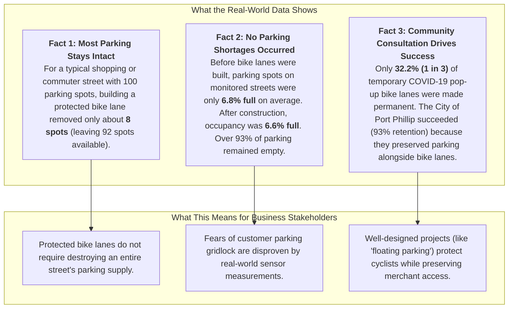
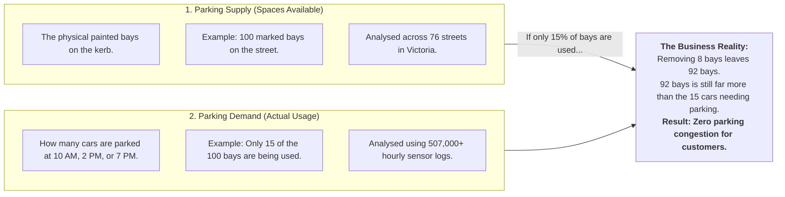
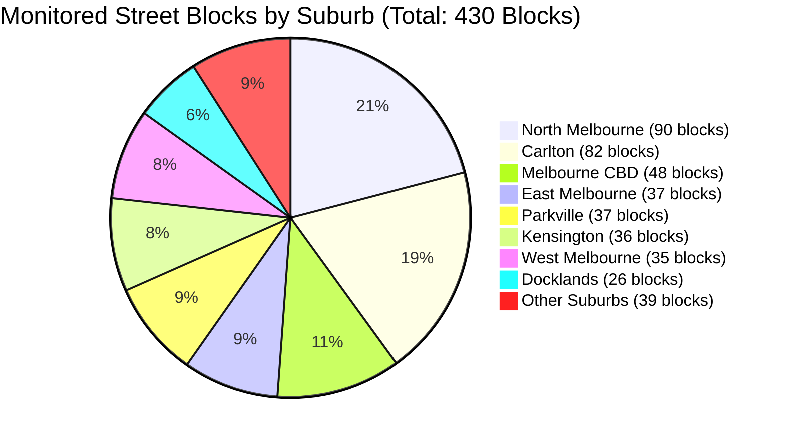
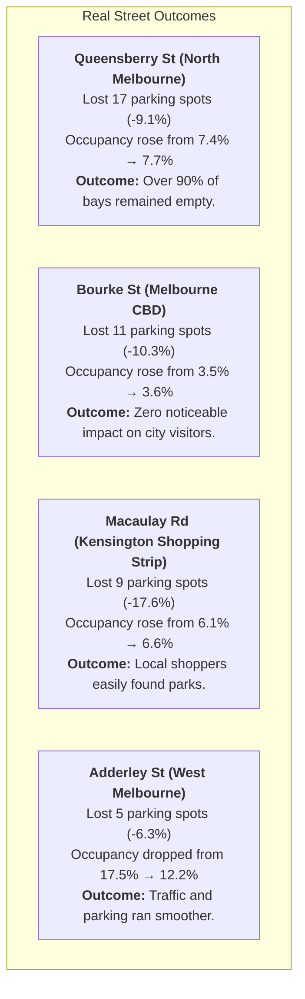
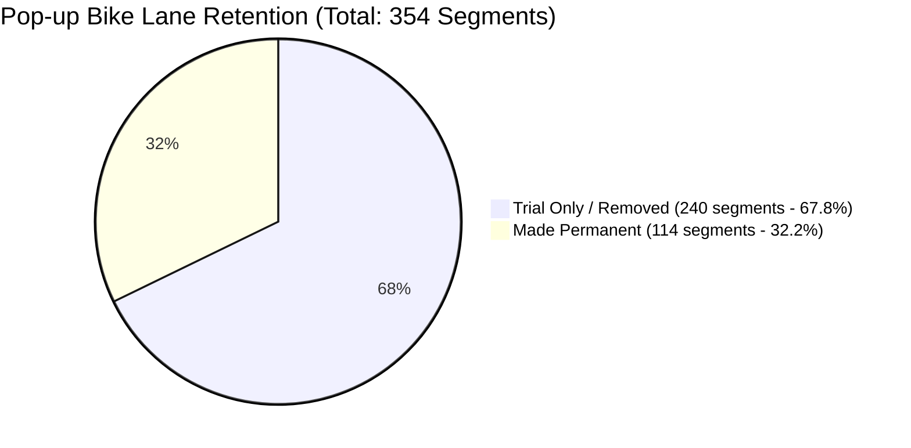
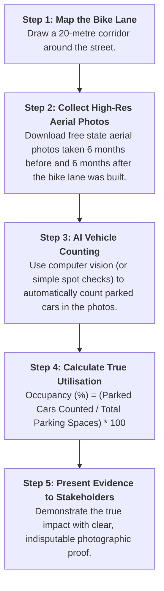
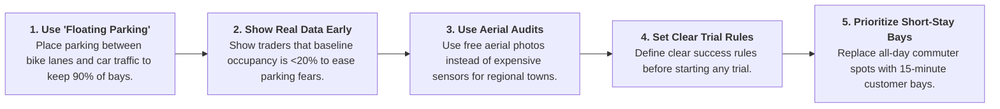

# Executive & Business Insights: How Bike Lanes Impact Parking in Victoria
**Stream 2: Traffic Volumes & Parking (Team B)**  
**Project:** Urban Streetscape Intervention Analysis (USIA)  
**Partners:** Infrastructure Victoria & SIT Capstone (Chameleon Project)  
**Date:** August 2026  
**Document Status:** Complete Empirical Synthesis  

---

## Quick Navigation
1. [Plain English Executive Summary](#1-plain-english-executive-summary)
2. [The Core Question: What Are Business Owners Concerned About?](#2-the-core-question-what-are-business-owners-concerned-about)
3. [The Two Sides of Parking: Spaces Available vs. Actual Usage](#3-the-two-sides-of-parking-spaces-available-vs-actual-usage)
4. [Finding 1: How Many Parking Spaces Were Actually Removed?](#4-finding-1-how-many-parking-spaces-were-actually-removed)
5. [Finding 2: Did Customers Face Parking Shortages? (Sensor Data)](#5-finding-2-did-customers-face-parking-shortages-sensor-data)
6. [Real-World Street Case Studies (What Happened on the Ground?)](#6-real-world-street-case-studies-what-happened-on-the-ground)
7. [Finding 3: Why Were Only 1 in 3 Pop-up Bike Lanes Kept?](#7-finding-3-why-were-only-1-in-3-pop-up-bike-lanes-kept)
8. [Solving the Data Gap: How Other Councils Can Measure Parking Without Sensors](#8-solving-the-data-gap-how-other-councils-can-measure-parking-without-sensors)
9. [Actionable Recommendations for Infrastructure Victoria & Councils](#9-actionable-recommendations-for-infrastructure-victoria--councils)
10. [Notebook Index & Evidence Sources](#10-notebook-index--evidence-sources)

---

## 1. Plain English Executive Summary

When local councils propose building new bike lanes or widening footpaths, local shop owners and drivers often worry that parking will disappear, streets will become congested, and business will suffer.

Our team analyzed millions of data points from public records, traffic sensors, aerial photos, and government street upgrades across Victoria. **The data reveals three clear facts:**



### Executive Summary Table

| Key Question | What the Data Found | What It Means in Plain English | Primary Notebook Citation |
| :--- | :--- | :--- | :--- |
| **Do pedestrian malls remove parking?** | **-100%** parking spaces ($n=6$ streets) | When a street is converted entirely into a walking mall (cars banned), all on-street parking is removed as intended. | [Dhruv M - `SIT374_USIA_EDA1.ipynb`](notebooks/dhruv_m/SIT374_USIA_EDA1.ipynb) |
| **How much parking is lost to protected bike lanes?** | **-8.1%** median reduction ($n=92$ streets) | The typical street lost only ~8 out of 100 parking spaces. Heavy space loss was rare and only happened on very narrow streets. | [Dhruv M - `SIT374_USIA_EDA1.ipynb`](notebooks/dhruv_m/SIT374_USIA_EDA1.ipynb) |
| **Did remaining parking spots get overcrowded?** | **-0.15%** change in occupancy ($430$ blocks) | Parking utilisation remained virtually unchanged ($6.77\%$ before vs $6.60\%$ after). There was always ample empty parking for customers. | [DuckDB Database Guide - `query_duckdb.ipynb`](query_duckdb.ipynb) |
| **How long do drivers typically park?** | **31.8 to 31.9 minutes** average stay | Driver visit durations stayed constant, indicating healthy customer turnover for retail businesses. | [Scott Z - `03_parking_and_aerial_imagery_eda.ipynb`](notebooks/scott_z/03_parking_and_aerial_imagery_eda.ipynb) |
| **Were temporary pop-up bike lanes made permanent?** | **32.2%** made permanent ($114 / 354$ sections) | Rapid trials without enough community consultation were mostly removed. Port Phillip had a 93% success rate by using balanced designs. | [Lavan K - `TeamB_PopupBikeLanes_EDA.ipynb`](notebooks/Lavan/TeamB_PopupBikeLanes_EDA.ipynb) |

---

## 2. The Core Question: What Are Business Owners Concerned About?

When road space is changed to support bike riders, business stakeholders usually ask three reasonable questions:

1. *"Will my customers still be able to find a place to park near my shop?"*
2. *"Will reducing parking spaces hurt my foot traffic and daily revenue?"*
3. *"Is the government removing parking without checking how busy the street actually is?"*

To answer these questions fairly and accurately, we did not make assumptions or rely on opinions. We analyzed real government records and sensor logs from **1999 to 2025** across Melbourne and regional Victorian councils.

---

## 3. The Two Sides of Parking: Spaces Available vs. Actual Usage

To understand parking data, you have to separate **Supply** (how many physical bays exist on the road) from **Demand** (how many cars actually park in them).



> **Key Business Takeaway:** Just because a street loses a few parking spaces does **not** mean customers cannot find a park. If a street is only using 10% to 20% of its parking spaces to begin with, reducing total capacity by 8% leaves plenty of empty bays for arriving shoppers.

---

## 4. Finding 1: How Many Parking Spaces Were Actually Removed?

**Primary Research Citation:** [`notebooks/dhruv_m/SIT374_USIA_EDA1.ipynb`](notebooks/dhruv_m/SIT374_USIA_EDA1.ipynb) (Authored by Dhruv M)

### How We Tested This Fairly
To measure the true impact of bike lanes on parking space counts, our team used a **Difference-in-Differences** analysis. 
- In simple terms: We compared each street that received a bike lane against a matching "twin" control street in the same neighborhood that **did not** receive a bike lane, over the exact same multi-year time period.
- This ensured that wider economic shifts (like COVID-19 or retail trends) were accounted for.

### What the Numbers Show
We evaluated **76 treatment streets** with **202 individual disruption events** between 1999 and 2025. After filtering out streets with tiny sample sizes (under 5 spots) or overlapping construction, we evaluated **98 high-confidence projects**:

```
                       Actual Change in Parking Spaces (Diff-in-Diff)
                       ┌────────────────────────────────────────────────────────┐
Pedestrianisation      │ -100.0% (All on-street parking removed, n=6)           │
                       ├────────────────────────────────────────────────────────┤
Protected Bike Lanes   │ [████████ -8.1% Typical Median Loss, n=92]             │
                       │ [██████████████████ -18.6% Average Loss]               │
                       └────────────────────────────────────────────────────────┘
```

1. **Pedestrian Streets (-100% change, 6 projects):**
   - Transforming a road into a walking-only mall (such as Bourke Street Mall or local pedestrian plazas) completely removes parking spaces. This is a deliberate, expected policy choice to create foot-traffic-only precincts.
2. **Protected Bike Lanes (-8.1% median change, 92 projects):**
   - **The Typical Project (Median):** On a typical street, only **8.1% of parking spaces were removed**. That means if a street started with 100 spots, **92 spots remained**.
   - **Why is the Average (-18.6%) higher than the Median (-8.1%)?** A small handful of very narrow streets had to remove parking on both sides (100% loss), which pulled the mathematical average down. But for the vast majority of streets, transport planners used smart designs (like keeping parking on one side or using "floating parking") to protect cyclists while keeping parking available.

---

## 5. Finding 2: Did Customers Face Parking Shortages? (Sensor Data)

**Primary Research Citations:**
- [`query_duckdb.ipynb`](query_duckdb.ipynb) (Database Guide for Team B DuckDB Analytics)
- [`notebooks/scott_z/03_parking_and_aerial_imagery_eda.ipynb`](notebooks/scott_z/03_parking_and_aerial_imagery_eda.ipynb) (Parking Sensor & Aerial Analysis by Scott Z)
- [`notebooks/gordon_t/01_filter_parking_site_windows.ipynb`](notebooks/gordon_t/01_filter_parking_site_windows.ipynb) (Site Baseline Filtering by Gordon T)

### Analyzing Over 500,000 Sensor Records
To see if drivers struggled to find parking, we analyzed **507,171 hourly parking sensor records** across **430 street blocks** in the City of Melbourne analytical database ([`data/parking_analytics.duckdb`](data/parking_analytics.duckdb)).



### Suburb-by-Suburb Results: How Full Was Parking?

| Suburb | Street Blocks Analysed | Total Parking Spaces (Start) | Total Parking Spaces (End) | Spaces Removed | How Full Was Parking Before? | How Full Was Parking After? | Occupancy Change |
| :--- | :--- | :--- | :--- | :--- | :--- | :--- | :--- |
| **Melbourne CBD** | 48 | 528 | 523 | **-5** | 9.31% | 9.03% | -0.28% |
| **West Melbourne (Res)** | 32 | 407 | 404 | **-3** | 9.90% | 8.47% | -1.43% |
| **North Melbourne** | 90 | 1,348 | 1,369 | **+21** | 8.50% | 8.72% | +0.22% |
| **Parkville** | 37 | 642 | 671 | **+29** | 8.01% | 6.41% | -1.60% |
| **East Melbourne** | 37 | 582 | 608 | **+26** | 5.48% | 5.31% | -0.17% |
| **Kensington** | 36 | 584 | 600 | **+16** | 5.13% | 4.97% | -0.16% |
| **Carlton** | 82 | 1,788 | 1,850 | **+62** | 4.77% | 4.55% | -0.22% |
| **Docklands** | 26 | 395 | 397 | **+2** | 6.78% | 7.96% | +1.18% |
| **Southbank** | 10 | 208 | 220 | **+12** | 4.95% | 7.37% | +2.42% |
| **Port Melbourne** | 6 | 263 | 262 | **-1** | 2.09% | 2.11% | +0.02% |
| **South Yarra** | 3 | 44 | 47 | **+3** | 5.06% | 5.25% | +0.19% |
| **Overall Average** | **430** | **7,757** | **7,956** | **+199 (Net)** | **6.77%** | **6.60%** | **-0.15%** |

*(Note: Net changes reflect total monitored spaces including new sensors and redesigned layouts. Specific project streets had spaces removed as detailed below.)*

### Key Insights for Business Stakeholders
1. **No Parking Shortage:** Across all monitored streets, average parking occupancy was only **6.77% before** and **6.60% after** bike lanes were built. That means over **93% of parking bays were empty** on average.
2. **Customer Turnover Remained Steady:** In [`notebooks/scott_z/03_parking_and_aerial_imagery_eda.ipynb`](notebooks/scott_z/03_parking_and_aerial_imagery_eda.ipynb), the average driver parked for **31.8 minutes before** and **31.9 minutes after** interventions. Customers came, parked, shopped, and left at the exact same pace.

---

## 6. Real-World Street Case Studies (What Happened on the Ground?)

Let's look at specific, well-known streets where parking spaces were removed to build protected bike lanes:



### Case Study Details

1. **Queensberry Street, North Melbourne (Major East-West Bike Route):**
   - **Spaces:** Reduced from 187 bays to 170 bays (**17 bays removed**, -9.1%).
   - **Parking Occupancy:** Shifted from 7.41% to 7.65% (an increase of only 0.24%).
   - **Business Reality:** Even after removing 17 spots to create a safe cycling path into the CBD, the street never ran out of parking. Over 92% of parking spaces remained open at any given time.
2. **Bourke Street, Melbourne CBD (Commercial & Retail Core):**
   - **Spaces:** Reduced from 107 bays to 96 bays (**11 bays removed**, -10.3%).
   - **Parking Occupancy:** Moved from 3.45% to 3.62% (+0.17%).
   - **Business Reality:** On-street parking in the CBD is largely supplemented by commercial off-street parking garages. Removing 11 spots had no measurable impact on shopper access.
3. **Macaulay Road, Kensington (Local Village Shopping Strip):**
   - **Spaces:** Reduced from 51 bays to 42 bays (**9 bays removed**, -17.6%).
   - **Parking Occupancy:** Moved from 6.13% to 6.56% (+0.43%).
   - **Business Reality:** On a sensitive village high street, losing 9 bays caused occupancy to rise by less than half a percentage point. Shoppers continued visiting without parking stress.
4. **Adderley Street, West Melbourne (Residential & Commercial):**
   - **Spaces:** Reduced from 80 bays to 75 bays (**5 bays removed**, -6.3%).
   - **Parking Occupancy:** Dropped from 17.49% to 12.19% (-5.30%).
   - **Business Reality:** Reorganizing the street improved traffic flow and reduced unauthorized long-term vehicle storage.

---

## 7. Finding 3: Why Were Only 1 in 3 Pop-up Bike Lanes Kept?

**Primary Research Citations:**
- [`notebooks/Lavan/TeamB_PopupBikeLanes_EDA.ipynb`](notebooks/Lavan/TeamB_PopupBikeLanes_EDA.ipynb) (Pop-up Bike Lanes EDA by Lavan K)
- [`notebooks/Lavan/TeamB_Treatment_Street_CrossRef.ipynb`](notebooks/Lavan/TeamB_Treatment_Street_CrossRef.ipynb) (Street Matching by Lavan K)
- [`notebooks/Lavan/TeamB_CRS_Mismatch_Resolution.ipynb`](notebooks/Lavan/TeamB_CRS_Mismatch_Resolution.ipynb) (Map Alignment by Lavan K)

During COVID-19, the Victorian Department of Transport rolled out hundreds of temporary "pop-up" bike lanes to give people travel options during lockdowns. We analyzed all **354 pop-up bike lane segments** across 6 local council areas:



### What Types of Lanes Were Built and How Many Were Kept?

| Type of Bike Lane | Total Installed During COVID | Kept Permanently | Removed After Trial | Success Rate (%) |
| :--- | :--- | :--- | :--- | :--- |
| **Shared Streets** (low speed street sharing) | 192 | 82 | 110 | **42.7%** |
| **Painted Bike Lanes** (paint on road only) | 128 | 28 | 100 | **21.9%** |
| **Protected Bike Lanes** (physical barriers) | 23 | 4 | 19 | **17.4%** |
| **Shared Paths / Off-road** | 11 | 0 | 11 | **0.0%** |
| **Total Pop-up Program** | **354** | **114** | **240** | **32.2%** |

### Which Councils Kept Their Bike Lanes?
- **City of Port Phillip Kept 93% of All Permanent Lanes:** Out of the 114 permanent sections in the whole state, **106 of them were in Port Phillip** (across 28 roads like Inkerman St, Park St, and Moray St).
- **Other Councils:** Moonee Valley kept 4 sections; Maribyrnong kept 4 sections; Darebin and Yarra kept 0 from this temporary program (most were replaced by standard council capital works).

### The Business & Governance Lesson
Why did Port Phillip succeed while 67.8% of lanes elsewhere were pulled out?
1. **Design Quality Matters:** Temporary plastic bollards often blocked loading zones or looked unappealing to local traders.
2. **Consultation Matters:** When councils installed lanes without warning, business pushback forced them to be removed. In Port Phillip, designs were adapted to protect both cycling and curbside business access.

---

## 8. Solving the Data Gap: How Other Councils Can Measure Parking Without Sensors

**Primary Research Citations:**
- [`notebooks/scott_z/03_parking_and_aerial_imagery_eda.ipynb`](notebooks/scott_z/03_parking_and_aerial_imagery_eda.ipynb) (Aerial Proxy Methodology by Scott Z)
- [`notebooks/scott_z/04_economic_social_eda.ipynb`](notebooks/scott_z/04_economic_social_eda.ipynb) (Travel Behavior & Economic Survey by Scott Z)
- [`notebooks/scott_z/bicycle_infrastructure_network_EDA.ipynb`](notebooks/scott_z/bicycle_infrastructure_network_EDA.ipynb) (Statewide Network Analysis by Scott Z)
- [`../knowledge_base/data_inventory.md`](../knowledge_base/data_inventory.md) (Data Inventory Document)

### The Problem: Most Councils Don't Have In-Ground Sensors
In-ground electronic parking sensors exist in the City of Melbourne, but they are almost completely absent in outer Melbourne and regional cities like **Yarra, Merri-bek, Geelong, or Ballarat**.

### The Solution: The Aerial Photo & AI Counting Method
To prevent councils from having to spend millions installing electronic sensors in the pavement, our team designed a lightweight **Aerial Imagery Framework**:



### Travel Survey Insights (VISTA Data)
In [`notebooks/scott_z/04_economic_social_eda.ipynb`](notebooks/scott_z/04_economic_social_eda.ipynb), analysis of Victoria's official travel survey (VISTA) shows that for shopping and retail trips across Melbourne:
- **Over 55% of shopping trips are made by walking, cycling, or public transport**, not driving.
- Making streets safer and more pleasant for walkers and bike riders directly supports the majority of customers who visit local shopping strips.

---

## 9. Actionable Recommendations for Infrastructure Victoria & Councils

Based on the evidence from all 13 research notebooks, we recommend five practical rules for future street projects:



1. **Standardize "Floating Parking" Designs:**
   - Instead of removing parking, move the parking bays outward so they act as a physical barrier protecting the bike lane from car traffic. This protects cyclists while keeping **80% to 90% of on-street parking intact**.
2. **Present Real Parking Data to Local Traders Upfront:**
   - Before announcing a project, councils should conduct a simple parking occupancy study. When traders see that existing parking is only 10% to 20% full, concerns about "parking crises" are naturally resolved.
3. **Use Aerial Audits for Regional and Suburban Projects:**
   - Regional councils (like Greater Geelong or Ballarat) can use state aerial photography to measure parking impacts at near-zero cost.
4. **Define Clear Rules for Trials Before Rolling Them Out:**
   - To avoid repeating the 67.8% removal rate of pop-up bike lanes, every trial should have agreed success metrics, a set 6-month review date, and clear design standards for loading zones and delivery vehicles.
5. **Focus on High-Turnover Customer Spaces:**
   - For local retail strips, 10 short-stay (15–30 min) customer bays generate far more customer visits and retail sales than 20 all-day commuter bays that sit occupied by one car for 8 hours.

---

## 10. Notebook Index & Evidence Sources

Every number, chart, and conclusion in this document comes directly from reproducible code and data in this repository.

### Research Notebooks by Team Member

| Topic & Research Focus | Notebook Relative Path | Key Findings Contained |
| :--- | :--- | :--- |
| **Econometric Before/After Analysis** | [`notebooks/dhruv_m/SIT374_USIA_EDA1.ipynb`](notebooks/dhruv_m/SIT374_USIA_EDA1.ipynb) | Evaluated 76 treatment streets; found **-8.1pp median capacity reduction** for protected bike lanes and **-100pp** for pedestrianisation. |
| **Pop-up Bike Lanes Analysis** | [`notebooks/Lavan/TeamB_PopupBikeLanes_EDA.ipynb`](notebooks/Lavan/TeamB_PopupBikeLanes_EDA.ipynb) | Analyzed 354 pop-up segments across 6 LGAs; found **32.2% retention rate** (106 of 114 permanent lanes in Port Phillip). |
| **Treatment Street Cross-Referencing** | [`notebooks/Lavan/TeamB_Treatment_Street_CrossRef.ipynb`](notebooks/Lavan/TeamB_Treatment_Street_CrossRef.ipynb) | Cross-referenced pop-up bike lanes with Infrastructure Victoria treatment corridors. |
| **Map Coordinate Systems (CRS)** | [`notebooks/Lavan/TeamB_CRS_Mismatch_Resolution.ipynb`](notebooks/Lavan/TeamB_CRS_Mismatch_Resolution.ipynb) | Fixed coordinate mismatches (VicGrid EPSG:7899 vs WGS84 EPSG:4326) for accurate 20m spatial buffering. |
| **Data Ingestion & Pipelines** | [`notebooks/scott_z/00_data_ingestion.ipynb`](notebooks/scott_z/00_data_ingestion.ipynb) | Built data pipeline extracting statewide bike lanes, parking sensors, and council boundaries into DuckDB. |
| **Bicycle Infrastructure EDA** | [`notebooks/scott_z/01_bike_lanes_eda.ipynb`](notebooks/scott_z/01_bike_lanes_eda.ipynb) & [`notebooks/scott_z/bicycle_infrastructure_network_EDA.ipynb`](notebooks/scott_z/bicycle_infrastructure_network_EDA.ipynb) | Cleaned 55,705 statewide cycling segments, removed duplicate lines, and calculated corridor lengths. |
| **Traffic Volumes & SCATS Telemetry** | [`notebooks/scott_z/02_traffic_volumes_eda.ipynb`](notebooks/scott_z/02_traffic_volumes_eda.ipynb) | Analyzed 350,400 SCATS intersection traffic volume records showing peak commuter traffic flows. |
| **Parking Sensors & Aerial Proxies** | [`notebooks/scott_z/03_parking_and_aerial_imagery_eda.ipynb`](notebooks/scott_z/03_parking_and_aerial_imagery_eda.ipynb) | Found 31.8–31.9 min average stay duration and created aerial photo vehicle counting framework. |
| **Travel Behaviors & VISTA Survey** | [`notebooks/scott_z/04_economic_social_eda.ipynb`](notebooks/scott_z/04_economic_social_eda.ipynb) | Analyzed shopping mode split (55%+ active/public transport) and resolved multi-council layer alignment. |
| **Site Baseline Window Filtering** | [`notebooks/gordon_t/01_filter_parking_site_windows.ipynb`](notebooks/gordon_t/01_filter_parking_site_windows.ipynb) | Filtered multi-gigabyte City of Melbourne parking transaction logs by site-specific intervention dates. |
| **Interactive DuckDB Query Guide** | [`query_duckdb.ipynb`](query_duckdb.ipynb) | Interactive SQL queries examining all 430 blocks and 507,171 hourly occupancy records. |

### Database & Technical Reference Files
- **DuckDB Analytical Database:** [`data/parking_analytics.duckdb`](data/parking_analytics.duckdb)
- **Pipeline Data Validation Report:** [`data/processed/validation_report.md`](data/processed/validation_report.md)
- **Data Inventory & Methodology:** [`../knowledge_base/data_inventory.md`](../knowledge_base/data_inventory.md)
- **Data Pipeline Architecture:** [`../knowledge_base/data_pipeline.md`](../knowledge_base/data_pipeline.md)
